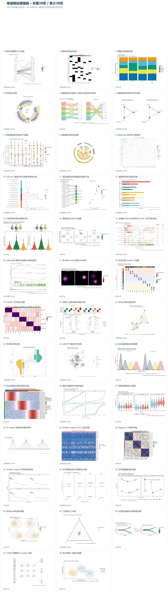

# 单细胞绘图模板 · 38项公开副本

本目录由 luvega fork 维护，包含38个可独立运行的R绘图包：20个已有案例结果衍生示例（derived_example），18个合成示例（synthetic）。来源于四批单细胞作图整理，保持稳定的 sc- 模板身份、相对输入、独立入口和中文说明。

[luvega 版使用说明](../../README.luvega.zh-CN.md) · [预览总览](preview-overview.png) · [目录与资产哈希](catalog.json) · [验证状态](VALIDATION.md) · [许可与来源](LICENSE_NOTICE.md)



## 使用

1. 从本目录下的 templates 选择一个包，将整个目录复制到自己的工作目录。
2. 按包内 README 准备 R 依赖，依照 data_schema.yml 替换 data 中的表格，并调整 params.yml。
3. 在该工作副本根目录运行 `Rscript --vanilla code/plot.R`，生成 preview.png 和 plot.pdf。

全部模板共用的依赖集合：`ComplexHeatmap`、`circlize`、`ggplot2`、`ggrepel`、`igraph`、`patchwork`、`ragg`、`yaml`。每包只需自己的依赖；ComplexHeatmap通过Bioconductor获取，其余列出的包通过CRAN获取。每包 evidence/sessionInfo.txt 记录实际验证环境和版本；未将这些包或R本体打包上传。

当前输入是预计算结果或合成表格。模板仅绘图及明确声明的轻量转换，不重跑聚类、差异分析、轨迹、富集或通讯推断。

## 接入 SFL 0.9.0

这些目录是可运行案例，托管到GitHub本身不会自动注册为Provider。需要收入自己的本机图库时，在仓库根目录执行：

```sh
node scripts/private-template-tools.mjs candidate --template examples/single-cell/templates/sc-spatial-communication-overlay --out ../sc-spatial-candidate.local.json
```

将本机生成的候选交给 SFL 的 plan_publish，审阅后 apply_publish。候选继续采用 unknown 许可和本机使用范围；不得把公开可下载理解为已取得新的再分发许可。sc-spatial-candidate.local.json 含本机资产路径，应保留在仓库外的本机工作区。详见 [迁移工具说明](../../docs/PRIVATE_TEMPLATE_MIGRATION.zh-CN.md)。SFL不执行绘图；由宿主执行代码。

## 模板目录

| 模板 | 数据范围 | 预览 |
| --- | --- | --- |
| [配体与靶基因二分网络](templates/sc-bipartite-ligand-target/README.md) | derived_example | [PNG](templates/sc-bipartite-ligand-target/preview.png) / [PDF](templates/sc-bipartite-ligand-target/plot.pdf) |
| [离散类别矩阵热图](templates/sc-categorical-heatmap/README.md) | derived_example | [PNG](templates/sc-categorical-heatmap/preview.png) / [PDF](templates/sc-categorical-heatmap/plot.pdf) |
| [细胞比例堆叠柱图](templates/sc-celltype-stacked-proportion/README.md) | synthetic | [PNG](templates/sc-celltype-stacked-proportion/preview.png) / [PDF](templates/sc-celltype-stacked-proportion/plot.pdf) |
| [环形表达热图](templates/sc-circular-heatmap/README.md) | derived_example | [PNG](templates/sc-circular-heatmap/preview.png) / [PDF](templates/sc-circular-heatmap/plot.pdf) |
| [细胞类型与克隆大小类别计数组成冲积图](templates/sc-clonotype-alluvial/README.md) | synthetic | [PNG](templates/sc-clonotype-alluvial/preview.png) / [PDF](templates/sc-clonotype-alluvial/plot.pdf) |
| [细胞通讯候选定向环形网络](templates/sc-communication-circle-network/README.md) | derived_example | [PNG](templates/sc-communication-circle-network/preview.png) / [PDF](templates/sc-communication-circle-network/plot.pdf) |
| [多组细胞通讯受配体气泡图](templates/sc-communication-group-bubble/README.md) | derived_example | [PNG](templates/sc-communication-group-bubble/preview.png) / [PDF](templates/sc-communication-group-bubble/plot.pdf) |
| [细胞通讯受配体弦图](templates/sc-communication-lr-chord/README.md) | derived_example | [PNG](templates/sc-communication-lr-chord/preview.png) / [PDF](templates/sc-communication-lr-chord/plot.pdf) |
| [Spearman 相关性气泡矩阵](templates/sc-correlation-spearman-bubble/README.md) | derived_example | [PNG](templates/sc-correlation-spearman-bubble/preview.png) / [PDF](templates/sc-correlation-spearman-bubble/plot.pdf) |
| [DEscore 通路方向与富集显著性比较](templates/sc-enrichment-descore/README.md) | derived_example | [PNG](templates/sc-enrichment-descore/preview.png) / [PDF](templates/sc-enrichment-descore/plot.pdf) |
| [基因通路成员桑基图与富集气泡](templates/sc-enrichment-gene-sankey/README.md) | derived_example | [PNG](templates/sc-enrichment-gene-sankey/preview.png) / [PDF](templates/sc-enrichment-gene-sankey/plot.pdf) |
| [通路条形图与基因列表](templates/sc-enrichment-pathway-genes/README.md) | derived_example | [PNG](templates/sc-enrichment-pathway-genes/preview.png) / [PDF](templates/sc-enrichment-pathway-genes/plot.pdf) |
| [小提琴图与表达细胞比例](templates/sc-expression-violin-fraction/README.md) | synthetic | [PNG](templates/sc-expression-violin-fraction/preview.png) / [PDF](templates/sc-expression-violin-fraction/plot.pdf) |
| [基因表达UMAP分面图](templates/sc-feature-umap/README.md) | synthetic | [PNG](templates/sc-feature-umap/preview.png) / [PDF](templates/sc-feature-umap/plot.pdf) |
| [多通路 GSEA 命中排名与 NES／校正P复合图](templates/sc-gsea-multiterm-rank/README.md) | derived_example | [PNG](templates/sc-gsea-multiterm-rank/preview.png) / [PDF](templates/sc-gsea-multiterm-rank/plot.pdf) |
| [GSEA 运行富集分数曲线与基因排名](templates/sc-gsea-running-enrichment/README.md) | derived_example | [PNG](templates/sc-gsea-running-enrichment/preview.png) / [PDF](templates/sc-gsea-running-enrichment/plot.pdf) |
| [预计算marker密度UMAP图](templates/sc-marker-density-umap/README.md) | synthetic | [PNG](templates/sc-marker-density-umap/preview.png) / [PDF](templates/sc-marker-density-umap/plot.pdf) |
| [多层注释 marker 气泡图](templates/sc-marker-dotplot-annotated/README.md) | synthetic | [PNG](templates/sc-marker-dotplot-annotated/preview.png) / [PDF](templates/sc-marker-dotplot-annotated/plot.pdf) |
| [marker 平均表达热图](templates/sc-marker-mean-heatmap/README.md) | synthetic | [PNG](templates/sc-marker-mean-heatmap/preview.png) / [PDF](templates/sc-marker-mean-heatmap/plot.pdf) |
| [多群火山图与差异基因计数](templates/sc-multigroup-volcano-counts/README.md) | synthetic | [PNG](templates/sc-multigroup-volcano-counts/preview.png) / [PDF](templates/sc-multigroup-volcano-counts/plot.pdf) |
| [PAGA 群体连接网络](templates/sc-paga-connectivity-network/README.md) | derived_example | [PNG](templates/sc-paga-connectivity-network/preview.png) / [PDF](templates/sc-paga-connectivity-network/plot.pdf) |
| [样本配对雨云图](templates/sc-paired-raincloud/README.md) | derived_example | [PNG](templates/sc-paired-raincloud/preview.png) / [PDF](templates/sc-paired-raincloud/plot.pdf) |
| [分组 PPI 基因互作网络](templates/sc-ppi-group-network/README.md) | derived_example | [PNG](templates/sc-ppi-group-network/preview.png) / [PDF](templates/sc-ppi-group-network/plot.pdf) |
| [拟时轴细胞类型密度图](templates/sc-pseudotime-celltype-density/README.md) | synthetic | [PNG](templates/sc-pseudotime-celltype-density/preview.png) / [PDF](templates/sc-pseudotime-celltype-density/plot.pdf) |
| [拟时序表达热图与模块注释](templates/sc-pseudotime-expression-heatmap/README.md) | synthetic | [PNG](templates/sc-pseudotime-expression-heatmap/preview.png) / [PDF](templates/sc-pseudotime-expression-heatmap/plot.pdf) |
| [基因与通路拟时趋势曲线](templates/sc-pseudotime-feature-trends/README.md) | derived_example | [PNG](templates/sc-pseudotime-feature-trends/preview.png) / [PDF](templates/sc-pseudotime-feature-trends/plot.pdf) |
| [细胞质量指标分面图](templates/sc-qc-metric-panels/README.md) | synthetic | [PNG](templates/sc-qc-metric-panels/preview.png) / [PDF](templates/sc-qc-metric-panels/plot.pdf) |
| [TF–target 候选定向调控网络](templates/sc-regulatory-tf-target-network/README.md) | derived_example | [PNG](templates/sc-regulatory-tf-target-network/preview.png) / [PDF](templates/sc-regulatory-tf-target-network/plot.pdf) |
| [SCENIC regulon AUC 活性热图](templates/sc-regulon-auc-heatmap/README.md) | derived_example | [PNG](templates/sc-regulon-auc-heatmap/preview.png) / [PDF](templates/sc-regulon-auc-heatmap/plot.pdf) |
| [Regulon CSI模块热图](templates/sc-regulon-csi-heatmap/README.md) | synthetic | [PNG](templates/sc-regulon-csi-heatmap/preview.png) / [PDF](templates/sc-regulon-csi-heatmap/plot.pdf) |
| [SCENIC regulon 特异性排序图](templates/sc-regulon-rss-ranking/README.md) | synthetic | [PNG](templates/sc-regulon-rss-ranking/preview.png) / [PDF](templates/sc-regulon-rss-ranking/plot.pdf) |
| [样本细胞类型比例箱线与点图](templates/sc-sample-celltype-proportion/README.md) | derived_example | [PNG](templates/sc-sample-celltype-proportion/preview.png) / [PDF](templates/sc-sample-celltype-proportion/plot.pdf) |
| [空间细胞通讯叠加图](templates/sc-spatial-communication-overlay/README.md) | synthetic | [PNG](templates/sc-spatial-communication-overlay/preview.png) / [PDF](templates/sc-spatial-communication-overlay/plot.pdf) |
| [空间spot特征数值图](templates/sc-spatial-feature-spots/README.md) | synthetic | [PNG](templates/sc-spatial-feature-spots/preview.png) / [PDF](templates/sc-spatial-feature-spots/plot.pdf) |
| [三组表达三元图](templates/sc-ternary-expression/README.md) | derived_example | [PNG](templates/sc-ternary-expression/preview.png) / [PDF](templates/sc-ternary-expression/plot.pdf) |
| [拟时轨迹曲线与降维叠加图](templates/sc-trajectory-curve-overlay/README.md) | synthetic | [PNG](templates/sc-trajectory-curve-overlay/preview.png) / [PDF](templates/sc-trajectory-curve-overlay/plot.pdf) |
| [UMAP 细胞群与 marker 注释](templates/sc-umap-marker-annotations/README.md) | synthetic | [PNG](templates/sc-umap-marker-annotations/preview.png) / [PDF](templates/sc-umap-marker-annotations/plot.pdf) |
| [预计算嵌入速度矢量图](templates/sc-velocity-vector-umap/README.md) | synthetic | [PNG](templates/sc-velocity-vector-umap/preview.png) / [PDF](templates/sc-velocity-vector-umap/plot.pdf) |

## 本地核对

在仓库根目录执行 `node examples/single-cell/verify.mjs`，核对公开包的文件哈希、相对路径和绘图证据绑定。该命令不运行R或修改图库。

公开副本不包含本机磁盘路径、服务绑定、发布审批回执、原始资料库归档或完整上游分析对象。每包保留来源条目名称、内容哈希、改造说明和实际许可状态。
