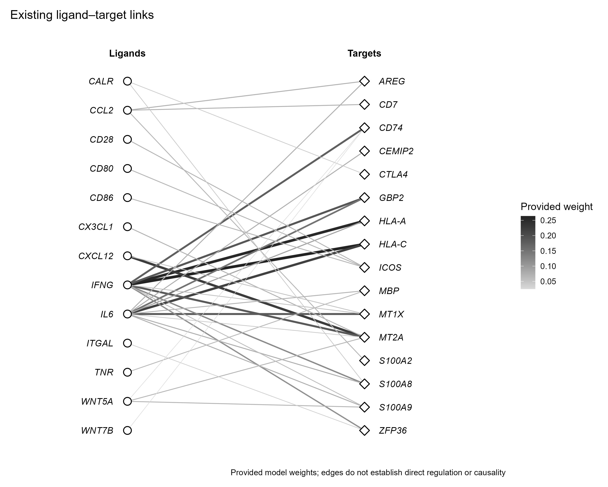

# 配体与靶基因二分网络

Bipartite ligand–target network

左右两列节点与连接展示已有关系，边宽和深浅表示输入权重。连线不证明直接调控或因果作用。



## 输入与运行

示例范围：**derived_example**。原始矩阵列为ligand、行为target，转换为正值边表后保留权重最大的36条连接。

- `data/edges.csv`：from,to,weight
- `data/nodes.csv`：id,side

先复制整个模板目录到自己的工作目录，安装下列依赖并将 Rscript 加入 PATH，然后在副本根目录执行：

```sh
Rscript --vanilla code/plot.R
```

R 包：`ggplot2`、`ragg`、`yaml`。参数见 [params.yml](params.yml)，字段及约束见 [data_schema.yml](data_schema.yml)。生成 [PNG](preview.png) 和 [PDF](plot.pdf)。完整依赖版本见 [sessionInfo](evidence/sessionInfo.txt)。代码不自动安装软件包。

## 数值含义和排序

- 删除原例随机生成up/down注释；无信息不虚构调控方向
- 权重保留来源值，不重算任何网络
- 连线只代表输入关系

## 应用场景

- 若已有配体–靶基因预测权重，可选择关注连接并说明模型来源。
- 也可展示两类实体关系，但需按输入重新定义节点角色和权重。

## 来源、验证与许可

[来源记录](provenance.md) · [逐文件绘图证据](evidence/render.json) · [验证摘要](evidence/validation-summary.json) · [许可说明](../../LICENSE_NOTICE.md)

本包为获准公开上传的副本，来源许可仍为 unknown；不因托管于本仓库而改为 MIT。绘图和数据接口验证不等于上游分析或科学结论验证。
