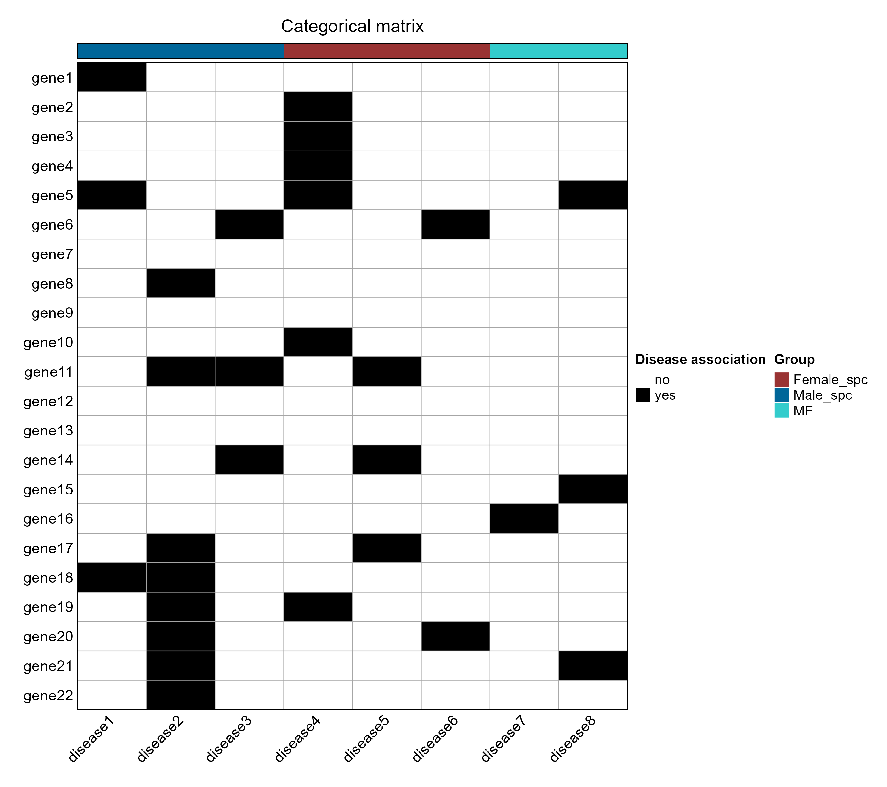

# 离散类别矩阵热图

Categorical state matrix heatmap

以离散颜色展示类别矩阵，并在顶部加入列分组注释；保持输入行列顺序，不把类别状态转换成连续表达量。



## 输入与运行

示例范围：**derived_example**。原教程 22×8 的 yes/no 矩阵，名称为 gene1–gene22、disease1–disease8；列分组按原代码明确给定的演示注释整理。

- `data/category_matrix.csv`：row_id 后为独立列名称，所有单元格为非空类别字符串
- `data/column_annotations.csv`：column_id/group/color；注释与矩阵列严格一一匹配
- `data/category_colors.csv`：category/color；覆盖全部实际类别的颜色映射

先复制整个模板目录到自己的工作目录，安装下列依赖并将 Rscript 加入 PATH，然后在副本根目录执行：

```sh
Rscript --vanilla code/plot.R
```

R 包：`ComplexHeatmap`、`ragg`、`yaml`。参数见 [params.yml](params.yml)，字段及约束见 [data_schema.yml](data_schema.yml)。生成 [PNG](preview.png) 和 [PDF](plot.pdf)。完整依赖版本见 [sessionInfo](evidence/sessionInfo.txt)。代码不自动安装软件包。

## 数值含义和排序

- 类别以字符读取，不进行 z-score、聚类、数值插值或连续梯度映射。
- 示例 no=#FFFFFF，yes=#000000；列组 Male_spc/Female_spc/MF 颜色沿用原代码，分组只是教程注释。
- 矩阵行 ID 和列名均须非空且唯一；类别映射唯一并覆盖全部实际类别，禁止遗漏或重复。
- 列注释以 column_id 匹配矩阵列，不依赖注释文件行序；未知、缺失及重复 ID 均报错。
- 默认保留矩阵输入行列顺序；完整名称保留，不拆分连字符、下划线或斜线。

## 应用场景

- 展示基因或其他实体在各组中的 yes/no 或多类别状态。
- 查看状态分布与给定列分组之间的关系，使用类别图例解释颜色。

## 来源、验证与许可

[来源记录](provenance.md) · [逐文件绘图证据](evidence/render.json) · [验证摘要](evidence/validation-summary.json) · [许可说明](../../LICENSE_NOTICE.md)

本包为获准公开上传的副本，来源许可仍为 unknown；不因托管于本仓库而改为 MIT。绘图和数据接口验证不等于上游分析或科学结论验证。
