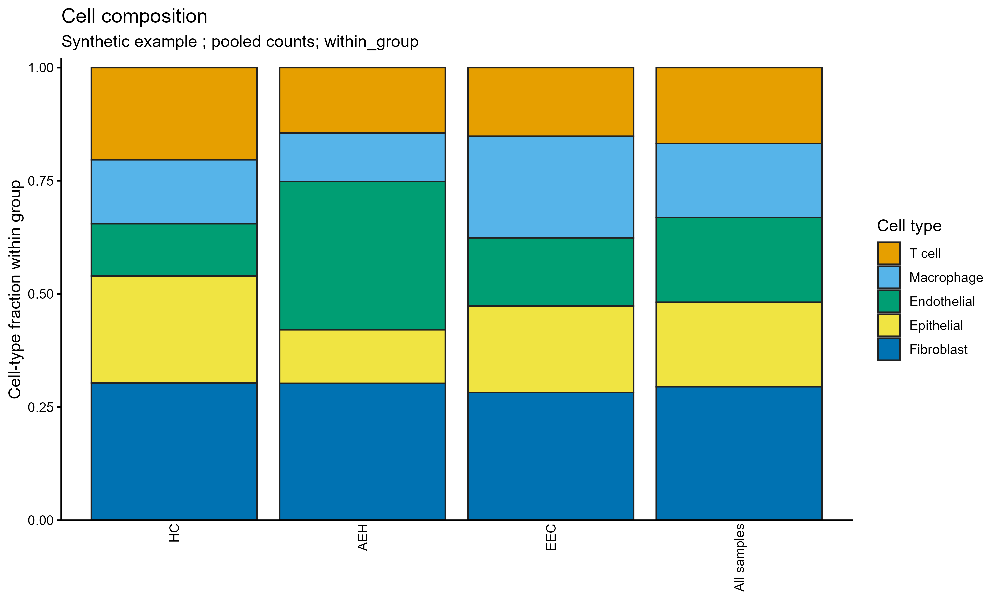

# 细胞比例堆叠柱图

Stacked cell-type fractions

保留原例黑边堆叠柱和总览柱，显式选择归一方向，默认以各组纳入细胞总数为分母。



## 输入与运行

示例范围：**synthetic**。每个sample_id×group×celltype的非负整数计数。

- `data/cell_counts.csv`：sample_id、group、celltype、count；每个样本只能属于一个group

先复制整个模板目录到自己的工作目录，安装下列依赖并将 Rscript 加入 PATH，然后在副本根目录执行：

```sh
Rscript --vanilla code/plot.R
```

R 包：`ggplot2`、`ragg`、`yaml`。参数见 [params.yml](params.yml)，字段及约束见 [data_schema.yml](data_schema.yml)。生成 [PNG](preview.png) 和 [PDF](plot.pdf)。完整依赖版本见 [sessionInfo](evidence/sessionInfo.txt)。代码不自动安装软件包。

## 数值含义和排序

- within_group默认：x轴是group、填色celltype，分母为该group所有纳入细胞数，各柱之和为1。
- within_celltype：x轴是celltype、填色group，分母为该celltype所有group细胞数，保留原案例归一方向和注释点。
- 组内先合并样本计数再计算比例，是按细胞数加权的pooled composition；不代表等权样本均值或差异丰度检验。
- 缺少组合按计数0补齐，但任何归一分母为0时停止；不丢弃零计数。
- 总览柱在within_group模式中为全体样本的细胞类型组成，在within_celltype模式中为全体细胞的组组成。

## 应用场景

- 比较病例或处理分组中纳入细胞的组成比例，观察哪个细胞类型占据较多或较少份额。
- 选择按细胞类型归一可观察同一种细胞在不同组之间的构成；样本计数汇总仅用于展示，不作差异丰度推断。

## 来源、验证与许可

[来源记录](provenance.md) · [逐文件绘图证据](evidence/render.json) · [验证摘要](evidence/validation-summary.json) · [许可说明](../../LICENSE_NOTICE.md)

本包为获准公开上传的副本，来源许可仍为 unknown；不因托管于本仓库而改为 MIT。绘图和数据接口验证不等于上游分析或科学结论验证。
