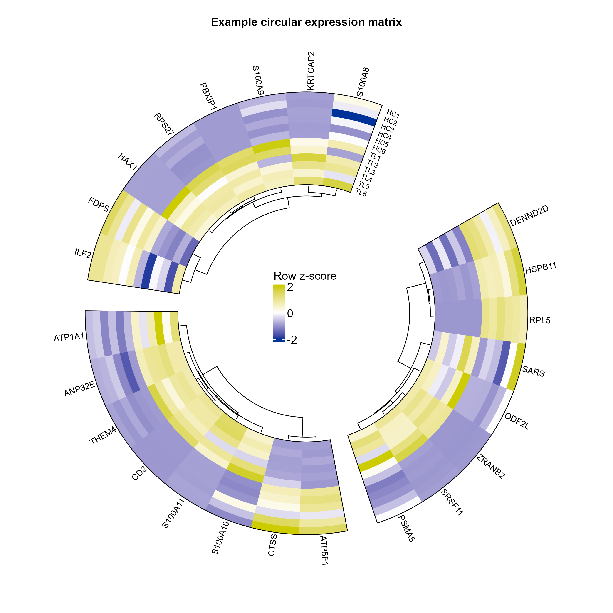

# 环形表达热图

Circular expression heatmap

数值矩阵绕圆周显示，径向轨道表示样本，扇区组织行集合。可显示原值或行z-score；行缩放表示相对模式。



## 输入与运行

示例范围：**derived_example**。原df_heat.csv前24行及12个样本列；每8行为一个排版Panel，数值未改。

- `data/expression.csv`：基因×样本矩阵
- `data/row_annotations.csv`：基因与排版sector

先复制整个模板目录到自己的工作目录，安装下列依赖并将 Rscript 加入 PATH，然后在副本根目录执行：

```sh
Rscript --vanilla code/plot.R
```

R 包：`circlize`、`ComplexHeatmap`、`ragg`、`yaml`。参数见 [params.yml](params.yml)，字段及约束见 [data_schema.yml](data_schema.yml)。生成 [PNG](preview.png) 和 [PDF](plot.pdf)。完整依赖版本见 [sessionInfo](evidence/sessionInfo.txt)。代码不自动安装软件包。

## 数值含义和排序

- Panel是排版分区，不是生物学模块
- 默认按行z-score；常数行赋0并警告
- 聚类仅用于行布局，不做上游分析
- 样本名沿正确热图track伸入开口；HC1到TL6由外到内，与列顺序匹配

## 应用场景

- 若已有表达或评分矩阵，可结合扇区和行标签展示模式。
- 行z-score颜色不能用于比较不同基因的绝对表达量。

## 来源、验证与许可

[来源记录](provenance.md) · [逐文件绘图证据](evidence/render.json) · [验证摘要](evidence/validation-summary.json) · [许可说明](../../LICENSE_NOTICE.md)

本包为获准公开上传的副本，来源许可仍为 unknown；不因托管于本仓库而改为 MIT。绘图和数据接口验证不等于上游分析或科学结论验证。
