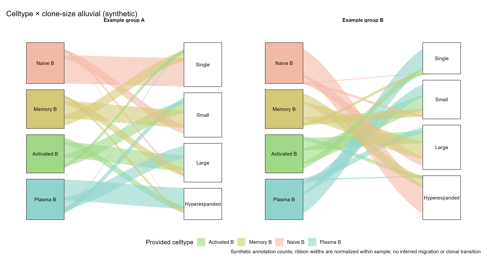

# 细胞类型与克隆大小类别计数组成冲积图

Celltype × clone-size alluvial (synthetic)

输入每样本已确定的celltype×clone_class交叉细胞计数，展示克隆大小类别的组成；条带按每样本总count为分母归一化。此输入不包含逐clone_id追踪。



## 输入与运行

示例范围：**synthetic**。sample/celltype/clone_class/count；每样本交叉计数，不是VDJ contig输入。

- `data/flows.csv`：sample/celltype/clone_class/count；每样本交叉计数，不是VDJ contig输入。

先复制整个模板目录到自己的工作目录，安装下列依赖并将 Rscript 加入 PATH，然后在副本根目录执行：

```sh
Rscript --vanilla code/plot.R
```

R 包：`ggplot2`、`yaml`、`ragg`。参数见 [params.yml](params.yml)，字段及约束见 [data_schema.yml](data_schema.yml)。生成 [PNG](preview.png) 和 [PDF](plot.pdf)。完整依赖版本见 [sessionInfo](evidence/sessionInfo.txt)。代码不自动安装软件包。

## 数值含义和排序

- 32行固定合成交叉计数；Single/Small/Large/Hyperexpanded仅为预设类别，不由此模板定义大小阈值。
- count是每样本相应celltype×clone_class的同批细胞计数，要求正整数且键唯一；先在外部汇总零记录。
- 宽度在每样本内按count比例缩放，两侧同一条带宽度保持一致；不把跨组类别条带解释为同一细胞的迁移。
- 条带是注释交叉分布；不重新组装VDJ、识别clone_id、推断克隆扩增或轨迹。
- 等效平滑polygon实现无需scRepertoire/ggalluvial，灰白节点和彩色celltype条带参考原图。

## 应用场景

在clone大小类别、celltype和样本注释已确定后比较两套注释的交叉组成，显示各celltype中的预分组克隆大小分布。

## 来源、验证与许可

[来源记录](provenance.md) · [逐文件绘图证据](evidence/render.json) · [验证摘要](evidence/validation-summary.json) · [许可说明](../../LICENSE_NOTICE.md)

本包为获准公开上传的副本，来源许可仍为 unknown；不因托管于本仓库而改为 MIT。绘图和数据接口验证不等于上游分析或科学结论验证。
