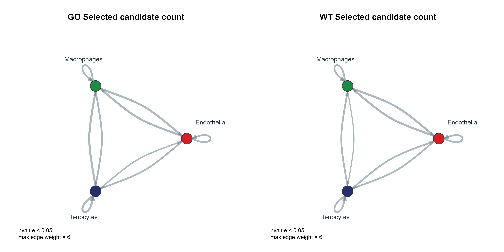

# 细胞通讯候选定向环形网络

Directed circle network of selected cell-interaction candidates

环形排列细胞类型，箭头只表示标准输入source到target的字段顺序；线宽编码已筛选候选配对数或已给权重之和，保留自环。



## 输入与运行

示例范围：**derived_example**。复用首批精确对齐的 GO/WT CPDB 教程子集：108 行，3×3 细胞类型、6 个 interaction_id。默认计数仅指这6个候选，不是完整通讯分析中的互作总量。

- `data/communication.csv`：group/source/target/ligand/receptor/interaction_id/value/pvalue 分列
- `data/nodes.csv`：celltype/colour/order；只控制节点风格，不使用虚构细胞数

先复制整个模板目录到自己的工作目录，安装下列依赖并将 Rscript 加入 PATH，然后在副本根目录执行：

```sh
Rscript --vanilla code/plot.R
```

R 包：`ggplot2`、`ragg`、`yaml`、`igraph`。参数见 [params.yml](params.yml)，字段及约束见 [data_schema.yml](data_schema.yml)。生成 [PNG](preview.png) 和 [PDF](plot.pdf)。完整依赖版本见 [sessionInfo](evidence/sessionInfo.txt)。代码不自动安装软件包。

## 数值含义和排序

- source→target 按分列字段传入，名称含下划线或竖线也不拆分。
- 过滤采用 value>0 且 pvalue<阈值；同 group/source/target/interaction_id 必须唯一。
- significant_pairs 是过滤后唯一候选记录的计数；sum_value 是同尺度输入 value 的直接求和。
- 缺少边的细胞对不补成显著边；节点颜色和顺序由独立注释给定；固定节点大小。
- 教程子集包含GJA1/GJA1等未由receptor_a/receptor_b标记确定配体—受体方向的候选；箭头只编码输入列顺序，不证明生物信号方向。

## 应用场景

- 查看选定受配体子集的细胞间候选联系。
- 已给权重尺度一致时，比较单组网络结构；不计算新通讯概率。

## 来源、验证与许可

[来源记录](provenance.md) · [逐文件绘图证据](evidence/render.json) · [验证摘要](evidence/validation-summary.json) · [许可说明](../../LICENSE_NOTICE.md)

本包为获准公开上传的副本，来源许可仍为 unknown；不因托管于本仓库而改为 MIT。绘图和数据接口验证不等于上游分析或科学结论验证。
