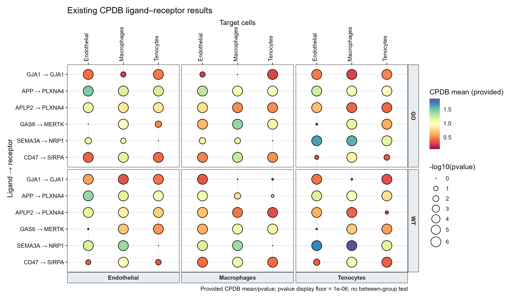

# 多组细胞通讯受配体气泡图

Grouped ligand–receptor bubble plot

分面比较各条件的已有受配体结果。颜色表示输入互作数值，面积表示已有pvalue的负对数；不构成新的组间差异检验。



## 输入与运行

示例范围：**derived_example**。GO/WT已有CPDB结果，3种source/target细胞及6组LR，共108行；按两组p≤0.05且mean>0的出现次数选LR。

- `data/communication.csv`：value为原始CPDB mean；其余为已有pvalue与明确配对字段

先复制整个模板目录到自己的工作目录，安装下列依赖并将 Rscript 加入 PATH，然后在副本根目录执行：

```sh
Rscript --vanilla code/plot.R
```

R 包：`ggplot2`、`ragg`、`yaml`。参数见 [params.yml](params.yml)，字段及约束见 [data_schema.yml](data_schema.yml)。生成 [PNG](preview.png) 和 [PDF](plot.pdf)。完整依赖版本见 [sessionInfo](evidence/sessionInfo.txt)。代码不自动安装软件包。

## 数值含义和排序

- source,target,ligand,receptor显式分列
- 缺失记录不补零；pvalue=0仅视觉变换截断
- 不执行通讯分析、不做跨组差异检验
- 横轴准确命名Target cells，避免原例Source cells误标

## 应用场景

- 若已完成各组CPDB或CellChat分析，可统一成长表后比较选定细胞对和LR结果。
- 图例须写明输入是CPDB mean还是CellChat probability，二者不可混用。

## 来源、验证与许可

[来源记录](provenance.md) · [逐文件绘图证据](evidence/render.json) · [验证摘要](evidence/validation-summary.json) · [许可说明](../../LICENSE_NOTICE.md)

本包为获准公开上传的副本，来源许可仍为 unknown；不因托管于本仓库而改为 MIT。绘图和数据接口验证不等于上游分析或科学结论验证。
