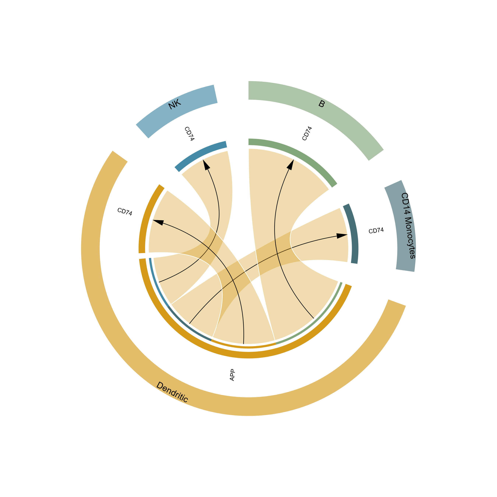

# 细胞通讯受配体弦图

Directed ligand–receptor chord diagram grouped by cell type

将已筛选的细胞通讯结果绘制为带方向的弦图，分别标出细胞类型扇区与受配体节点。



## 输入与运行

示例范围：**derived_example**。每行一条预计算关系，包含 source、target、ligand、receptor、value、pvalue；标识分列保存。

- `data/input.csv`：标准化、预先筛选的CellPhoneDB教程结果边表

先复制整个模板目录到自己的工作目录，安装下列依赖并将 Rscript 加入 PATH，然后在副本根目录执行：

```sh
Rscript --vanilla code/plot.R
```

R 包：`circlize`、`ragg`、`yaml`。参数见 [params.yml](params.yml)，字段及约束见 [data_schema.yml](data_schema.yml)。生成 [PNG](preview.png) 和 [PDF](plot.pdf)。完整依赖版本见 [sessionInfo](evidence/sessionInfo.txt)。代码不自动安装软件包。

## 数值含义和排序

- source/target/ligand/receptor保持分列，不拆分实体名称
- value采用输入mean；不作因果或实际信号传递判断
- pvalue仅用于显式阈值过滤，不重新检验
- 同细胞类型同基因节点合并，权重按原始边表传入

## 应用场景

- 查看 CellPhoneDB 或 CellChat 结果中指定细胞群之间的受配体候选关系。
- 聚焦少量受配体配对，用分组扇区减少网络图标签拥挤。

## 来源、验证与许可

[来源记录](provenance.md) · [逐文件绘图证据](evidence/render.json) · [验证摘要](evidence/validation-summary.json) · [许可说明](../../LICENSE_NOTICE.md)

本包为获准公开上传的副本，来源许可仍为 unknown；不因托管于本仓库而改为 MIT。绘图和数据接口验证不等于上游分析或科学结论验证。
