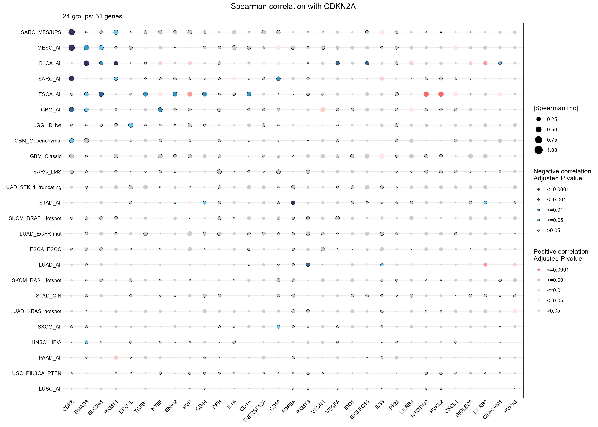

# Spearman 相关性气泡矩阵

Spearman correlation bubble matrix

将预计算 Spearman 相关结果按基因与分组排列，用气泡面积展示相关系数绝对值，并用蓝色和红色分别展示负、正相关的调整后 P 值等级。



## 输入与运行

示例范围：**derived_example**。原教程预计算结果共 744 行，包含 24 个组、31 个基因及目标 CDKN2A；系数和 P 值逐项保留。

- `data/correlations.csv`：group/gene/target/rho/pvalue/padj；预计算 Spearman 结果

先复制整个模板目录到自己的工作目录，安装下列依赖并将 Rscript 加入 PATH，然后在副本根目录执行：

```sh
Rscript --vanilla code/plot.R
```

R 包：`ggplot2`、`ragg`、`yaml`。参数见 [params.yml](params.yml)，字段及约束见 [data_schema.yml](data_schema.yml)。生成 [PNG](preview.png) 和 [PDF](plot.pdf)。完整依赖版本见 [sessionInfo](evidence/sessionInfo.txt)。代码不自动安装软件包。

## 数值含义和排序

- 不运行相关性检验，不调整或重新计算 P 值；rho 必须在 [-1,1]，pvalue 与 padj 必须在 [0,1]。
- 气泡面积编码 |rho|；rho=0 无面积，不归入正负相关；符号决定红或蓝。
- padj 使用 <=0.0001、<=0.001、<=0.01、<=0.05、>0.05 五个互斥等级，阈值边界不留空。
- 默认基因与组保留输入首次出现顺序；完整名称分列保存；缺失组合不补零。
- 原数据是教程提供的相关结果；本包不把相关方向解释为调控或因果关系。

## 应用场景

- 比较不同样本组或细胞类型中，目标基因与候选基因的相关方向及强度。
- 同时查看效应大小和多重检验调整后的显著性，筛选值得进一步验证的关联。

## 来源、验证与许可

[来源记录](provenance.md) · [逐文件绘图证据](evidence/render.json) · [验证摘要](evidence/validation-summary.json) · [许可说明](../../LICENSE_NOTICE.md)

本包为获准公开上传的副本，来源许可仍为 unknown；不因托管于本仓库而改为 MIT。绘图和数据接口验证不等于上游分析或科学结论验证。
