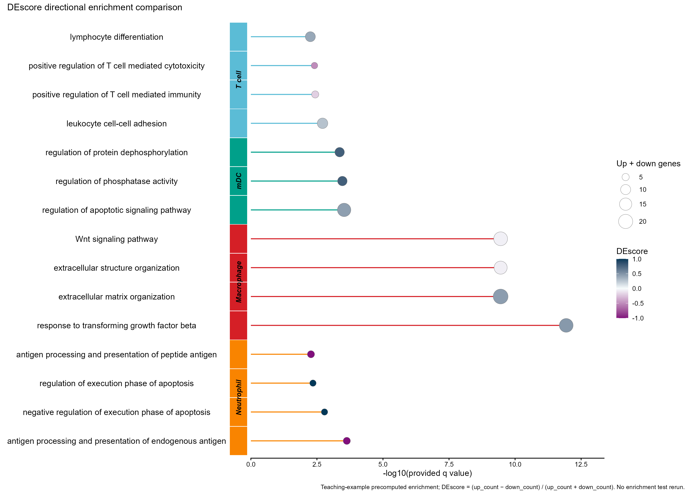

# DEscore 通路方向与富集显著性比较

DEscore directional enrichment comparison

保留2024-4-5棒棒糖图和细胞类型侧条带；横坐标为提供q值的-log10，气泡面积为上下调基因总数，颜色为有符号DEscore。



## 输入与运行

示例范围：**derived_example**。原DEscore.csv全部15行；pathway_id/description/group/celltype/qvalue/up_count/down_count/all_count/de_score

- `data/enrichment.csv`：原DEscore.csv全部15行；pathway_id/description/group/celltype/qvalue/up_count/down_count/all_count/de_score

先复制整个模板目录到自己的工作目录，安装下列依赖并将 Rscript 加入 PATH，然后在副本根目录执行：

```sh
Rscript --vanilla code/plot.R
```

R 包：`ggplot2`、`yaml`、`ragg`、`patchwork`。参数见 [params.yml](params.yml)，字段及约束见 [data_schema.yml](data_schema.yml)。生成 [PNG](preview.png) 和 [PDF](plot.pdf)。完整依赖版本见 [sessionInfo](evidence/sessionInfo.txt)。代码不自动安装软件包。

## 数值含义和排序

- 保留原DEscore.csv全部15行及文件顺序；不重新计算差异表达、GO富集或qvalue。
- DEscore=(up_count-down_count)/all_count，all_count=up_count+down_count；检查原值在1e-6内一致。
- 分组与celltype分列保存；Macrophage按真实原表标注，纠正来源图中将该块写为Neutrophil的固定文字。
- 横坐标=-log10(提供qvalue)，qvalue=0仅显示时使用参数下限；气泡面积编码上下调成员总数，不是背景基因数。
- 此有符号汇总表示通路差异基因的方向比例，不证明整个通路活性或因果效应。

## 应用场景

展示已经计算的通路结果及差异基因方向组成。

## 独立数据适配

- [adapters/descore-to-table.R](adapters/descore-to-table.R)

按脚本中的参数说明读取已有对象或结果。适配脚本由宿主单独执行，绘图入口不重跑上游分析。

## 来源、验证与许可

[来源记录](provenance.md) · [逐文件绘图证据](evidence/render.json) · [验证摘要](evidence/validation-summary.json) · [许可说明](../../LICENSE_NOTICE.md)

本包为获准公开上传的副本，来源许可仍为 unknown；不因托管于本仓库而改为 MIT。绘图和数据接口验证不等于上游分析或科学结论验证。
