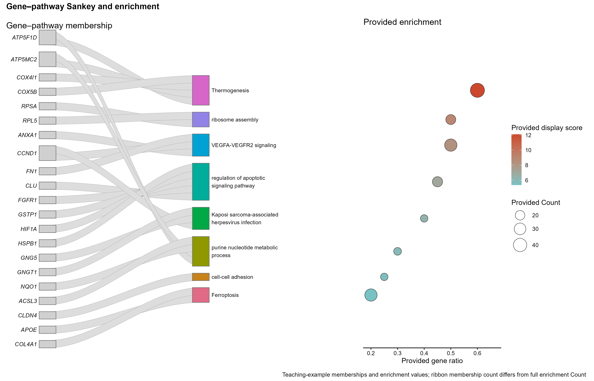

# 基因通路成员桑基图与富集气泡

Gene–pathway Sankey and enrichment

保留原教学小表中的gene/pathway成员边和独立富集量，以灰色条带和彩色通路节点结合右侧气泡显示。



## 输入与运行

示例范围：**derived_example**。gene/pathway/weight；原示例所选8通路的24条成员边。; pathway/gene_ratio/count/display_score；原教学富集摘要8行，Count不是当前显示基因数。

- `data/memberships.csv`：gene/pathway/weight；原示例所选8通路的24条成员边。
- `data/enrichment.csv`：pathway/gene_ratio/count/display_score；原教学富集摘要8行，Count不是当前显示基因数。

先复制整个模板目录到自己的工作目录，安装下列依赖并将 Rscript 加入 PATH，然后在副本根目录执行：

```sh
Rscript --vanilla code/plot.R
```

R 包：`ggplot2`、`yaml`、`ragg`、`patchwork`。参数见 [params.yml](params.yml)，字段及约束见 [data_schema.yml](data_schema.yml)。生成 [PNG](preview.png) 和 [PDF](plot.pdf)。完整依赖版本见 [sessionInfo](evidence/sessionInfo.txt)。代码不自动安装软件包。

## 数值含义和排序

- 来自原教学示例表，不宣称为本次真实生物数据或已重算富集。
- 按Enrichment.csv固定原文件顺序取前8通路；成员表仅保留匹配的gene/pathway/freq，weight=freq。
- gene_ratio=原Generatio，count=原Count；display_score仅为原Log(q-value)乘-1，不将其伪装为新计算的校正P值。
- 条带宽度为所示成员边weight；完整富集Count可能大于所示成员数，二者不得混用。
- 提供成员关系不意味着直接调控或因果关系；无聚类、富集检验或网络推断。

## 应用场景

展示所选富集通路的提供基因成员关系，并与同一通路已有gene ratio、完整Count和提供显示分数对应，适合GO/KEGG等筛选通路的成员清单与摘要联看。

## 来源、验证与许可

[来源记录](provenance.md) · [逐文件绘图证据](evidence/render.json) · [验证摘要](evidence/validation-summary.json) · [许可说明](../../LICENSE_NOTICE.md)

本包为获准公开上传的副本，来源许可仍为 unknown；不因托管于本仓库而改为 MIT。绘图和数据接口验证不等于上游分析或科学结论验证。
