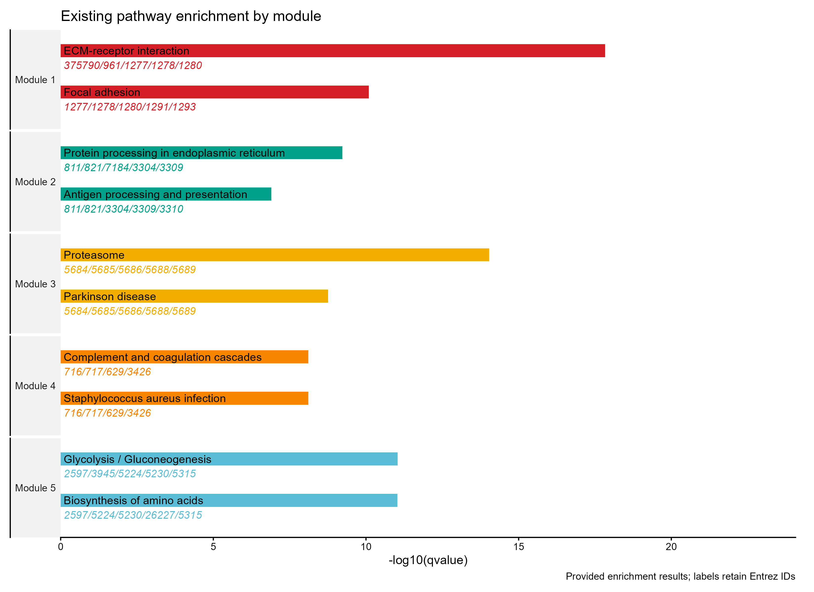

# 通路条形图与基因列表

Enrichment bars with gene labels

将已计算通路富集结果与命中基因一起展示。条长为已有qvalue的负对数，分组用颜色区分；不重做富集分析。



## 输入与运行

示例范围：**derived_example**。真实模块KEGG结果中按模块编号取前5个含有限qvalue的模块，各取qvalue最小的2条，共10条；genes为Entrez IDs，非gene symbols。

- `data/enrichment.csv`：已有qvalue与原始Entrez基因列表

先复制整个模板目录到自己的工作目录，安装下列依赖并将 Rscript 加入 PATH，然后在副本根目录执行：

```sh
Rscript --vanilla code/plot.R
```

R 包：`ggplot2`、`ragg`、`yaml`。参数见 [params.yml](params.yml)，字段及约束见 [data_schema.yml](data_schema.yml)。生成 [PNG](preview.png) 和 [PDF](plot.pdf)。完整依赖版本见 [sessionInfo](evidence/sessionInfo.txt)。代码不自动安装软件包。

## 数值含义和排序

- 输入qvalue保持原值，未重新富集或校正
- genes保留Entrez IDs，不伪称gene symbols
- 仅取前5模块各2条作为小示例；不是全量富集结果

## 应用场景

- 若已有多个细胞群或模块的富集表，可并列查看选定通路及其命中基因。
- 需要同时说明统计支持和具体基因时，可保留输入的原始基因标识。

## 来源、验证与许可

[来源记录](provenance.md) · [逐文件绘图证据](evidence/render.json) · [验证摘要](evidence/validation-summary.json) · [许可说明](../../LICENSE_NOTICE.md)

本包为获准公开上传的副本，来源许可仍为 unknown；不因托管于本仓库而改为 MIT。绘图和数据接口验证不等于上游分析或科学结论验证。
