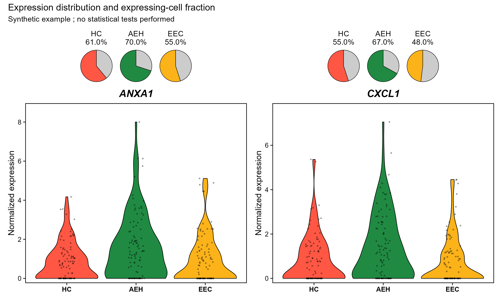

# 小提琴图与表达细胞比例

Expression violin and expressing-cell fraction

保留参考图的小提琴、细胞点、组配色和上方表达比例饼图；只显示用户提供的比较标注。



## 输入与运行

示例范围：**synthetic**。包含零值的cell_id×gene表达长表和样本分组；可选预计算比较标注表。

- `data/expression.csv`：cell_id、sample_id、group、gene、expression；包含零表达细胞
- `data/significance.csv`：可选；gene、group1、group2、label，可另加y_position；默认空表不画统计标签

先复制整个模板目录到自己的工作目录，安装下列依赖并将 Rscript 加入 PATH，然后在副本根目录执行：

```sh
Rscript --vanilla code/plot.R
```

R 包：`ggplot2`、`patchwork`、`ragg`、`yaml`。参数见 [params.yml](params.yml)，字段及约束见 [data_schema.yml](data_schema.yml)。生成 [PNG](preview.png) 和 [PDF](plot.pdf)。完整依赖版本见 [sessionInfo](evidence/sessionInfo.txt)。代码不自动安装软件包。

## 数值含义和排序

- 表达比例分母是该gene×group输入的全部纳入细胞，分子是expression > expression_threshold的细胞；默认阈值0。
- 每个纳入cell_id必须包含每个展示gene的一行，包括零表达；仅输入表达细胞会导致比例高估。
- 仅展示预计算significance.csv；不运行细胞层面t.test，不把细胞当独立生物重复。
- sample_id用于保留样本来源，但密度和比例为细胞级pooled展示，不自动作样本加权或组间推断。
- 示例显著性表为空；合成表达分布不赋予显著性标签。

## 应用场景

- 并列展示各组特定基因的细胞级表达密度与零表达比例，区分表达强度变化和表达细胞份额变化。
- 在保留sample_id的表达长表上显示上游提供的比较标签，避免由绘图模板自动进行细胞层面显著性检验。

## 来源、验证与许可

[来源记录](provenance.md) · [逐文件绘图证据](evidence/render.json) · [验证摘要](evidence/validation-summary.json) · [许可说明](../../LICENSE_NOTICE.md)

本包为获准公开上传的副本，来源许可仍为 unknown；不因托管于本仓库而改为 MIT。绘图和数据接口验证不等于上游分析或科学结论验证。
