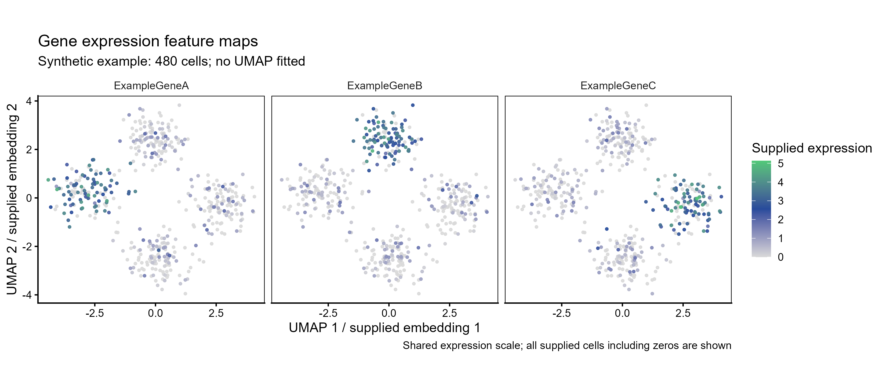

# 基因表达UMAP分面图

Gene expression feature maps on supplied UMAP

在相同嵌入坐标上以连续色标显示多个基因的表达值，比较各表达区域的位置与强度。



## 输入与运行

示例范围：**synthetic**。cell_id×gene长表，每个基因包含同一批细胞及其固定umap_1、umap_2和非负expression。

- `data/feature_expression.csv`：480个合成细胞×3个示例基因，含零表达

先复制整个模板目录到自己的工作目录，安装下列依赖并将 Rscript 加入 PATH，然后在副本根目录执行：

```sh
Rscript --vanilla code/plot.R
```

R 包：`ggplot2`、`ragg`、`yaml`。参数见 [params.yml](params.yml)，字段及约束见 [data_schema.yml](data_schema.yml)。生成 [PNG](preview.png) 和 [PDF](plot.pdf)。完整依赖版本见 [sessionInfo](evidence/sessionInfo.txt)。代码不自动安装软件包。

## 数值含义和排序

- 输入坐标和表达量保持原值，不重跑UMAP或归一化。
- 每个基因必须包含相同细胞，包括零表达；同一cell_id坐标须一致。
- 所有基因共用0到最大输入值色标；指定expression_max须覆盖所有输入值，禁止静默截断。
- 灰蓝绿配色与黑边框来自来源脚本；横向基因分面采用共同尺度。
- 合成坐标由四个正态点团生成，属于模拟嵌入，不是实际拟合的UMAP。

## 应用场景

- 用预计算UMAP坐标与细胞级表达长表查看不同基因在已注释细胞区域的分布。
- 在多个基因的表达单位一致时使用共同数值色标，保留零表达细胞并比较表达范围。

## 来源、验证与许可

[来源记录](provenance.md) · [逐文件绘图证据](evidence/render.json) · [验证摘要](evidence/validation-summary.json) · [许可说明](../../LICENSE_NOTICE.md)

本包为获准公开上传的副本，来源许可仍为 unknown；不因托管于本仓库而改为 MIT。绘图和数据接口验证不等于上游分析或科学结论验证。
