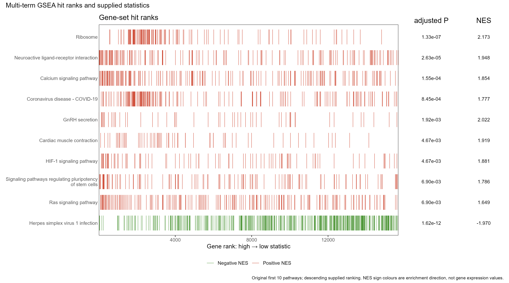

# 多通路 GSEA 命中排名与 NES／校正P复合图

Multi-term GSEA hit rank and statistics

保留2024-8-9多通路排名条带、正负方向颜色及右侧NES和校正P文字或气泡；这不是经典运行ES曲线。



## 输入与运行

示例范围：**derived_example**。完整降序排名15681行；gene_id/rank/statistic; 原前10条通路完整匹配基因；pathway_id/gene_id/rank; 原结果前10行；pathway_id/description/set_size/enrichment_score/nes/p_adjust

- `data/ranking.csv`：完整降序排名15681行；gene_id/rank/statistic
- `data/hits.csv`：原前10条通路完整匹配基因；pathway_id/gene_id/rank
- `data/enrichment.csv`：原结果前10行；pathway_id/description/set_size/enrichment_score/nes/p_adjust

先复制整个模板目录到自己的工作目录，安装下列依赖并将 Rscript 加入 PATH，然后在副本根目录执行：

```sh
Rscript --vanilla code/plot.R
```

R 包：`ggplot2`、`yaml`、`ragg`、`patchwork`。参数见 [params.yml](params.yml)，字段及约束见 [data_schema.yml](data_schema.yml)。生成 [PNG](preview.png) 和 [PDF](plot.pdf)。完整依赖版本见 [sessionInfo](evidence/sessionInfo.txt)。代码不自动安装软件包。

## 数值含义和排序

- 选取2024-8-9原res.RData结果表前10行，保留通路名称、匹配setSize、NES和p.adjust。
- 正NES条带在上、负NES在下；组内保留结果表顺序。基因排名由高统计量到低统计量。
- 本图编码基因集命中条带，不绘制运行ES曲线；不将条带称为经典GSEA曲线。
- 默认以文字直接显示NES和p.adjust；气泡模式面积为matched set_size，校正P颜色为-ln(p.adjust)，与来源函数保持自然对数尺度。
- P=0仅在气泡显示使用声明下限，不修改输入值；不重新估计NES、P值或富集结果。

## 应用场景

并列展示所选多个GSEA通路的命中排名和已有统计摘要。

## 独立数据适配

- [adapters/gsea-result-to-tables.R](adapters/gsea-result-to-tables.R)

按脚本中的参数说明读取已有对象或结果。适配脚本由宿主单独执行，绘图入口不重跑上游分析。

## 来源、验证与许可

[来源记录](provenance.md) · [逐文件绘图证据](evidence/render.json) · [验证摘要](evidence/validation-summary.json) · [许可说明](../../LICENSE_NOTICE.md)

本包为获准公开上传的副本，来源许可仍为 unknown；不因托管于本仓库而改为 MIT。绘图和数据接口验证不等于上游分析或科学结论验证。
