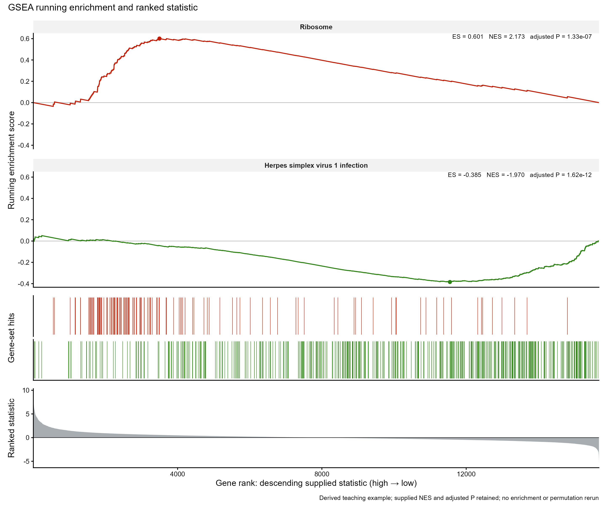

# GSEA 运行富集分数曲线与基因排名

GSEA running enrichment and ranked statistic

保留经典三层结构：运行ES曲线、基因集命中条带和原排名统计量。例示正负富集两条通路。



## 输入与运行

示例范围：**derived_example**。完整降序排名15681行；gene_id/rank/statistic; 所选通路完整匹配基因；pathway_id/gene_id/rank; 原结果中Ribosome和Herpes simplex virus 1 infection两条通路，保留ES/NES/p_adjust/set_size; 两条完整运行ES轨迹，每条15681行；由适配器重建并核对原存储ES

- `data/ranking.csv`：完整降序排名15681行；gene_id/rank/statistic
- `data/hits.csv`：所选通路完整匹配基因；pathway_id/gene_id/rank
- `data/enrichment.csv`：原结果中Ribosome和Herpes simplex virus 1 infection两条通路，保留ES/NES/p_adjust/set_size
- `data/curves.csv`：两条完整运行ES轨迹，每条15681行；由适配器重建并核对原存储ES

先复制整个模板目录到自己的工作目录，安装下列依赖并将 Rscript 加入 PATH，然后在副本根目录执行：

```sh
Rscript --vanilla code/plot.R
```

R 包：`ggplot2`、`yaml`、`ragg`、`patchwork`。参数见 [params.yml](params.yml)，字段及约束见 [data_schema.yml](data_schema.yml)。生成 [PNG](preview.png) 和 [PDF](plot.pdf)。完整依赖版本见 [sessionInfo](evidence/sessionInfo.txt)。代码不自动安装软件包。

## 数值含义和排序

- 使用2024-8-9原教学res.RData中的预计算GSEA结果；选hsa03010与hsa05168，非本次真实样本分析。
- 排名统计量保持原15681个基因及降序；高统计量在左，低统计量在右，修正来源图的左右文字方向。
- 适配器从提供geneList和geneSets按存储exponent=1重建展示曲线；每条曲线最大绝对极值与存储enrichmentScore误差≤1e-6。
- NES、p.adjust和setSize从原结果直接保留；未做富集、置换、多重校正或上游差异分析。
- 绘图脚本只读取CSV，不加载Seurat/GSEA对象或调用富集分析函数。

## 应用场景

用于展示已经完成的GSEA通路结果及其排名方向。

## 独立数据适配

- [adapters/gsea-result-to-tables.R](adapters/gsea-result-to-tables.R)

按脚本中的参数说明读取已有对象或结果。适配脚本由宿主单独执行，绘图入口不重跑上游分析。

## 来源、验证与许可

[来源记录](provenance.md) · [逐文件绘图证据](evidence/render.json) · [验证摘要](evidence/validation-summary.json) · [许可说明](../../LICENSE_NOTICE.md)

本包为获准公开上传的副本，来源许可仍为 unknown；不因托管于本仓库而改为 MIT。绘图和数据接口验证不等于上游分析或科学结论验证。
