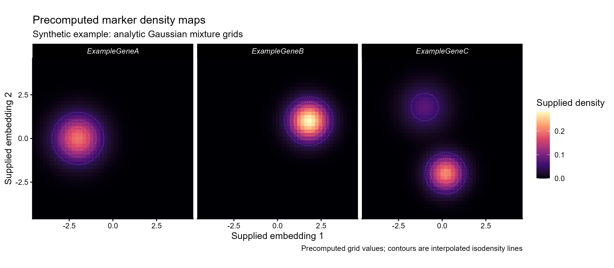

# 预计算marker密度UMAP图

Precomputed marker density maps

将已给定的二维marker密度网格绘为黑底色面，并用等值线标出密度层次，比较多个基因高值区域的位置。



## 输入与运行

示例范围：**synthetic**。gene×x×y的完整等距矩形网格，density为有限非负的预计算值；所有基因共享网格。

- `data/density_grid.csv`：3个示例基因×45×45合成二维密度网格

先复制整个模板目录到自己的工作目录，安装下列依赖并将 Rscript 加入 PATH，然后在副本根目录执行：

```sh
Rscript --vanilla code/plot.R
```

R 包：`ggplot2`、`ragg`、`yaml`。参数见 [params.yml](params.yml)，字段及约束见 [data_schema.yml](data_schema.yml)。生成 [PNG](preview.png) 和 [PDF](plot.pdf)。完整依赖版本见 [sessionInfo](evidence/sessionInfo.txt)。代码不自动安装软件包。

## 数值含义和排序

- 入口只读已计算density_grid.csv，不运行KDE、Nebulosa、表达阈值筛选或降维。
- 源图采用细胞点密度，新模板明确采用完整矩形密度网格色面；两者输入结构不同。
- 等值线由已有grid插值形成，不是重新估计密度，也不是细胞类型边界。
- 所有基因共用密度数值色标；输入值不重新归一化或按峰值缩放。
- 合成示例为解析高斯混合密度，固定网格，无真实基因或细胞类型结论。

## 应用场景

- 展示外部计算的marker密度结果，查看表达相关高值区域与既有嵌入空间的位置关系。
- 当多个基因的密度方法、单位和网格一致时，用共同色标比较密度数值；不同方法结果应单独解释。

## 来源、验证与许可

[来源记录](provenance.md) · [逐文件绘图证据](evidence/render.json) · [验证摘要](evidence/validation-summary.json) · [许可说明](../../LICENSE_NOTICE.md)

本包为获准公开上传的副本，来源许可仍为 unknown；不因托管于本仓库而改为 MIT。绘图和数据接口验证不等于上游分析或科学结论验证。
