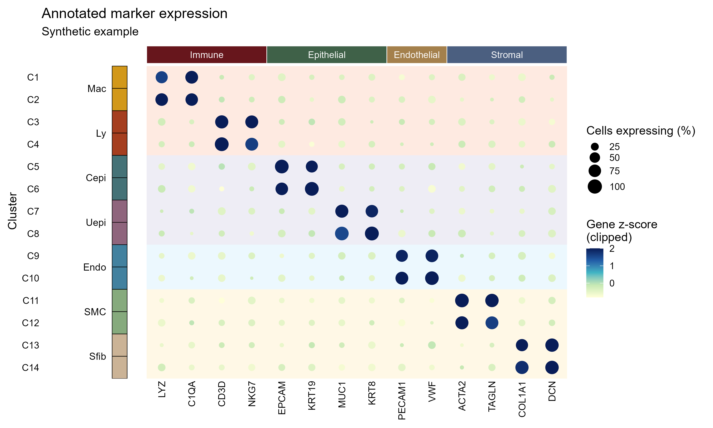

# 多层注释 marker 气泡图

Annotated marker dot plot

顶部基因功能分区、左侧细胞类型色条、谱系背景和表达气泡叠加，保留 2025-8-8 参考图的多层注释结构。



## 输入与运行

示例范围：**synthetic**。预计算 gene×cluster 平均表达和 0–100 表达百分比，加两张对应注释表。

- `data/expression_summary.csv`：gene、cluster_id、average_expression、percent_expressed；每个gene×cluster组合一行
- `data/gene_annotations.csv`：gene、marker_celltype、gene_group；行顺序为基因顺序
- `data/cluster_annotations.csv`：cluster_id、celltype、lineage；行顺序为从上到下的cluster顺序

先复制整个模板目录到自己的工作目录，安装下列依赖并将 Rscript 加入 PATH，然后在副本根目录执行：

```sh
Rscript --vanilla code/plot.R
```

R 包：`ggplot2`、`ragg`、`yaml`。参数见 [params.yml](params.yml)，字段及约束见 [data_schema.yml](data_schema.yml)。生成 [PNG](preview.png) 和 [PDF](plot.pdf)。完整依赖版本见 [sessionInfo](evidence/sessionInfo.txt)。代码不自动安装软件包。

## 数值含义和排序

- 输入平均表达是宿主预计算的非负均值，不调用 FindAllMarkers、DotPlot 或 Seurat。
- 表达细胞百分比须以该 cluster 全部纳入细胞为分母，范围 0–100；零值保留。
- 默认按每个基因跨 cluster 计算 z-score，剪裁 [-1,2]，气泡色标题明确写 Gene z-score；可选 mean 显示原均值。
- 注释 CSV 行顺序决定坐标顺序；缺少gene×cluster组合时停止，不能隐式补零。
- 顶部gene_group与左侧celltype分区由连续注释块计算，不使用原图的硬编码细胞索引。

## 应用场景

- 用每个cluster的预计算marker均值和表达比例核对细胞类型注释，观察同一谱系内外的marker分布。
- 同时展示基因分区、细胞类型与谱系的对应关系，便于发现注释与表达模式不一致的cluster。

## 来源、验证与许可

[来源记录](provenance.md) · [逐文件绘图证据](evidence/render.json) · [验证摘要](evidence/validation-summary.json) · [许可说明](../../LICENSE_NOTICE.md)

本包为获准公开上传的副本，来源许可仍为 unknown；不因托管于本仓库而改为 MIT。绘图和数据接口验证不等于上游分析或科学结论验证。
