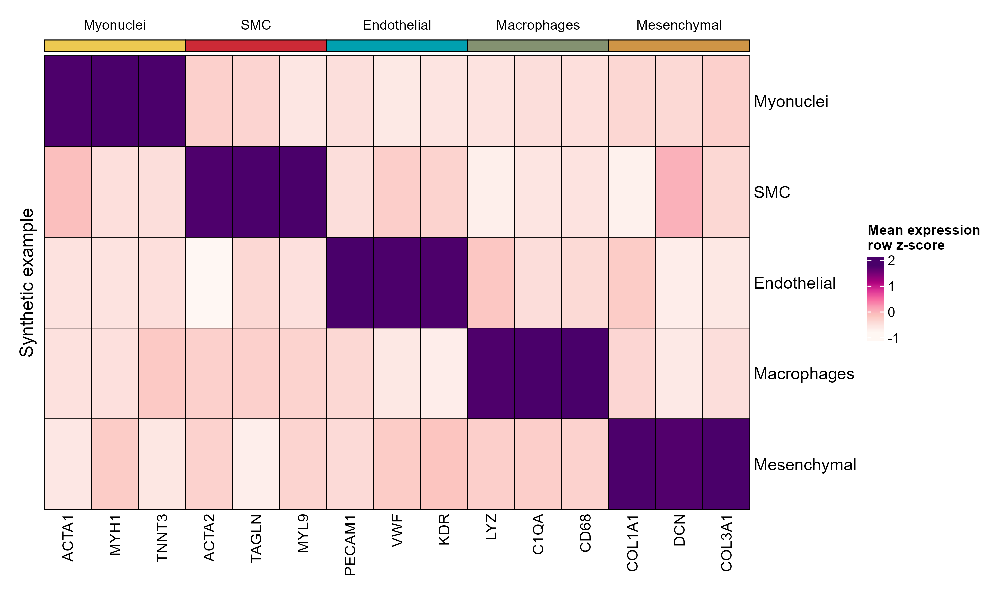

# marker 平均表达热图

Marker mean expression heatmap

预计算平均表达矩阵经明确尺度转换，按 marker 所属细胞类型排列，并保留原图顶部色条、分块和细黑色单元边框。



## 输入与运行

示例范围：**synthetic**。唯一 gene 行、celltype 列的预计算均值矩阵及匹配注释。

- `data/mean_expression.csv`：第一列gene，其余列为celltype，数值为上游已计算的均值
- `data/gene_annotations.csv`：gene、marker_celltype；每个gene仅一行
- `data/celltype_annotations.csv`：celltype、color；行顺序决定细胞类型顺序

先复制整个模板目录到自己的工作目录，安装下列依赖并将 Rscript 加入 PATH，然后在副本根目录执行：

```sh
Rscript --vanilla code/plot.R
```

R 包：`ComplexHeatmap`、`circlize`、`ragg`、`yaml`。参数见 [params.yml](params.yml)，字段及约束见 [data_schema.yml](data_schema.yml)。生成 [PNG](preview.png) 和 [PDF](plot.pdf)。完整依赖版本见 [sessionInfo](evidence/sessionInfo.txt)。代码不自动安装软件包。

## 数值含义和排序

- 模板接收真正预计算的均值；不运行 AverageExpression 或 AggregateExpression。
- 默认按基因跨细胞类型计算row z-score，图例明确标注，不能将 z-score 误读为原平均表达。
- 恒定基因的z-score置0并告警；none模式直接显示输入值，需设置input_scale_label。
- 基因注释必须与矩阵行一一匹配、细胞类型注释与列一一匹配，缺失或多余标识均停止。
- horizontal默认显示细胞类型为行、marker基因为列；vertical显示基因为行。

## 应用场景

- 对已定义细胞类型的预计算marker均值进行排序展示，观察标记基因在其所属类型与其他类型中的相对表达。
- 用顶部marker类型色条组织基因分块；解释均值的z-score尺度时保留上游汇总定义。

## 来源、验证与许可

[来源记录](provenance.md) · [逐文件绘图证据](evidence/render.json) · [验证摘要](evidence/validation-summary.json) · [许可说明](../../LICENSE_NOTICE.md)

本包为获准公开上传的副本，来源许可仍为 unknown；不因托管于本仓库而改为 MIT。绘图和数据接口验证不等于上游分析或科学结论验证。
