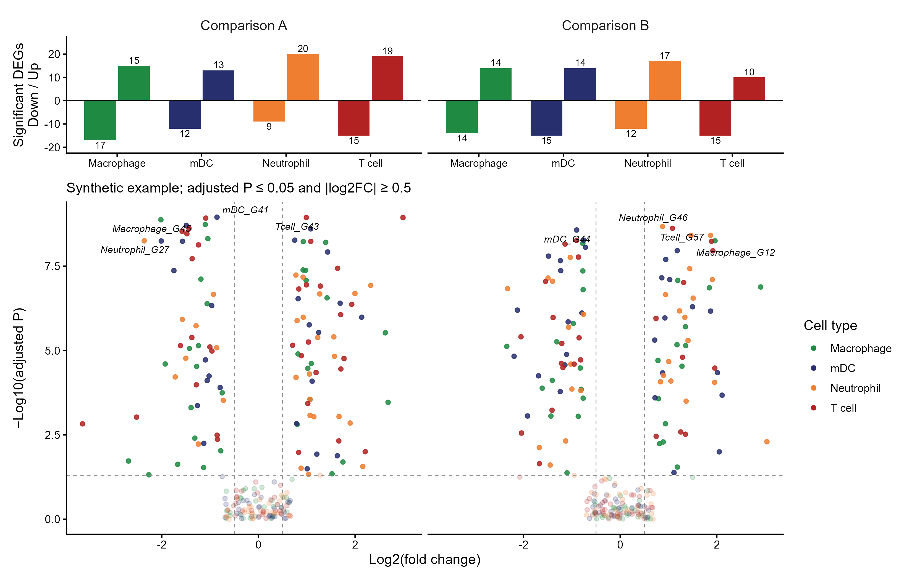

# 多群火山图与差异基因计数

Multigroup volcano and DEG counts

保留原案例多色细胞类型火山点及上方上下调计数柱；显著性阈值同时控制分类、计数和标签。



## 输入与运行

示例范围：**synthetic**。comparison×celltype×gene 的log2FC和已校正p值；可选label布尔列。

- `data/differential_results.csv`：comparison、celltype、gene、log2_fc、p_adj；可另加label布尔列

先复制整个模板目录到自己的工作目录，安装下列依赖并将 Rscript 加入 PATH，然后在副本根目录执行：

```sh
Rscript --vanilla code/plot.R
```

R 包：`ggplot2`、`patchwork`、`ggrepel`、`ragg`、`yaml`。参数见 [params.yml](params.yml)，字段及约束见 [data_schema.yml](data_schema.yml)。生成 [PNG](preview.png) 和 [PDF](plot.pdf)。完整依赖版本见 [sessionInfo](evidence/sessionInfo.txt)。代码不自动安装软件包。

## 数值含义和排序

- 不运行 FindMarkers，不随机赋予病例分组；输入为已经完成差异分析的结果。
- 统一显著性规则p_adj ≤ p_adj_threshold且abs(log2_fc) ≥ log2_fc_threshold且log2_fc不为0。
- 上下调计数和标签只来自满足同一显著性规则的基因；不将所有正负logFC点都计作DEG。
- p_adj=0仅在绘图时替换为zero_p_floor，原值保留在输出表中；不会重新校正p值。
- 默认每comparison×celltype最多标注最低p_adj的一基因；label列可显式选择，但不标注未达阈值基因。

## 应用场景

- 比较多个预计算对比中各细胞类型的log2FC、校正p值及符合统一阈值的上下调基因数。
- 在上下调计数条与火山点中使用一致的细胞类型颜色和显著性标准，便于核对基因标签与DEG数目。

## 来源、验证与许可

[来源记录](provenance.md) · [逐文件绘图证据](evidence/render.json) · [验证摘要](evidence/validation-summary.json) · [许可说明](../../LICENSE_NOTICE.md)

本包为获准公开上传的副本，来源许可仍为 unknown；不因托管于本仓库而改为 MIT。绘图和数据接口验证不等于上游分析或科学结论验证。
