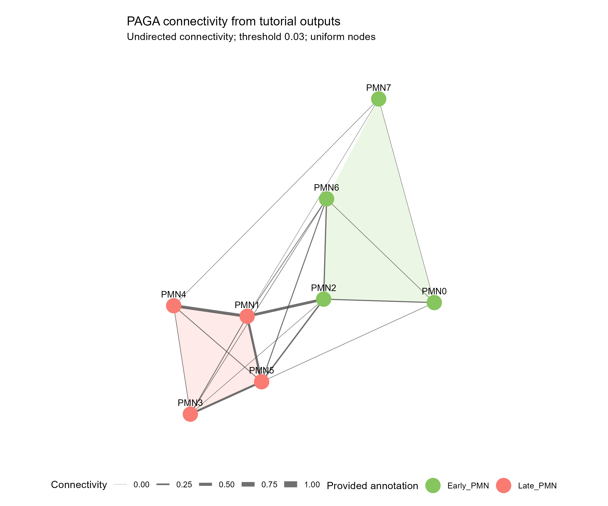

# PAGA 群体连接网络

PAGA group connectivity network

使用提供的群体坐标和连接权重绘制PAGA抽象网络；连线宽度表示连接值，可选择按提供的细胞数显示节点面积。



## 输入与运行

示例范围：**derived_example**。从2023-12-14教程HTML输出表提取8个群体坐标与25条边，数值保留教程展示精度。教程未提供节点计数表，示例节点大小统一。

- `data/nodes.csv`：node_id/x/y/n_cells/group；n_cells允许为空，只有计数模式才必需
- `data/edges.csv`：source/target/connectivity；唯一无向边，权重[0,1]

先复制整个模板目录到自己的工作目录，安装下列依赖并将 Rscript 加入 PATH，然后在副本根目录执行：

```sh
Rscript --vanilla code/plot.R
```

R 包：`ggplot2`、`ragg`、`yaml`。参数见 [params.yml](params.yml)，字段及约束见 [data_schema.yml](data_schema.yml)。生成 [PNG](preview.png) 和 [PDF](plot.pdf)。完整依赖版本见 [sessionInfo](evidence/sessionInfo.txt)。代码不自动安装软件包。

## 数值含义和排序

- PAGA连接为无向关系，不绘制箭头、不解释为拟时方向或谱系因果。
- 按node_id匹配坐标和边，禁止按行顺序替换布局；名称完整保存。
- 示例坐标与连接来自已显示的输出表，精度为6位小数；不冒称原对象完整精度。
- 只有明确提供n_cells才启用节点面积编码；示例uniform模式不编造细胞数。
- 阈值只筛选显示边，节点保留；边宽统一以[0,1]为尺度。

## 应用场景

- 展示已有PAGA群体连接及其预计算布局。
- 根据明确阈值查看较强连接，同时保留没有显示边的节点。

## 独立数据适配

- [adapters/edges-from-connectivity.R](adapters/edges-from-connectivity.R)

按脚本中的参数说明读取已有对象或结果。适配脚本由宿主单独执行，绘图入口不重跑上游分析。

## 来源、验证与许可

[来源记录](provenance.md) · [逐文件绘图证据](evidence/render.json) · [验证摘要](evidence/validation-summary.json) · [许可说明](../../LICENSE_NOTICE.md)

本包为获准公开上传的副本，来源许可仍为 unknown；不因托管于本仓库而改为 MIT。绘图和数据接口验证不等于上游分析或科学结论验证。
