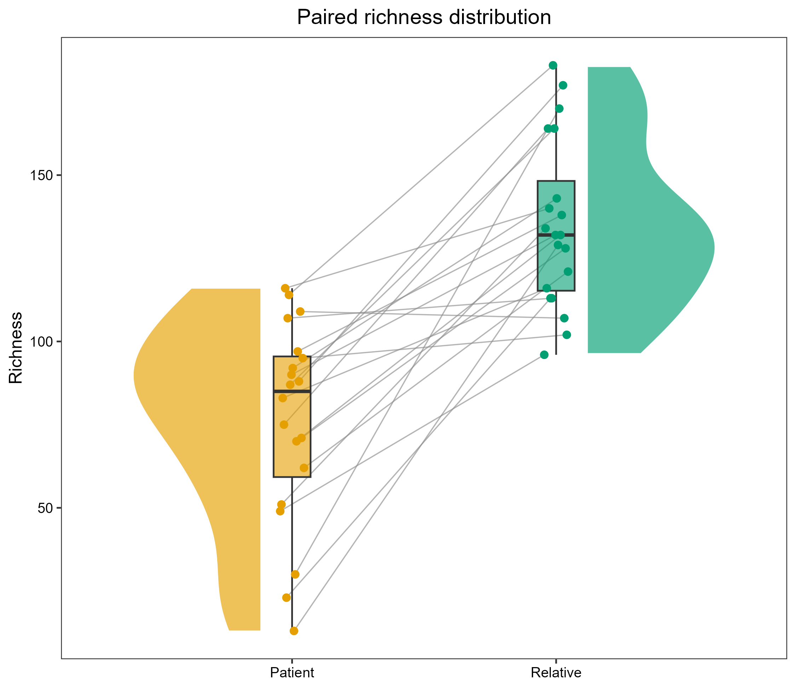

# 样本配对雨云图

Paired sample raincloud plot

将两个配对组的半小提琴、箱线、样本点与连接线组合展示，使总体分布和每对样本的变化同时可见。



## 输入与运行

示例范围：**derived_example**。保留原教程 40 个样本、20 个 Family.ID 配对及 Richness 数值；Patient 与 Relative 各 20 个。配对键来自 Family.ID。

- `data/paired_values.csv`：sample_id/donor_id/pair_id/group/value；每对每组仅一个样本
- `data/comparisons.csv`：可选预计算标注 group1/group2/y/label；允许只有表头

先复制整个模板目录到自己的工作目录，安装下列依赖并将 Rscript 加入 PATH，然后在副本根目录执行：

```sh
Rscript --vanilla code/plot.R
```

R 包：`ggplot2`、`ragg`、`yaml`。参数见 [params.yml](params.yml)，字段及约束见 [data_schema.yml](data_schema.yml)。生成 [PNG](preview.png) 和 [PDF](plot.pdf)。完整依赖版本见 [sessionInfo](evidence/sessionInfo.txt)。代码不自动安装软件包。

## 数值含义和排序

- 原示例严格将 Family.ID 映射为 pair_id，DonorID 仅保留为 donor_id，不用来连接样本。
- 必须正好两个组；sample_id 全局唯一；pair_id/group 唯一，每对两组完整，不默默丢弃未配对样本。
- 小提琴密度和箱线分位数仅是绘图汇总；所有输入样本数值保留，不执行显著性检验或推断。
- 所有连线连接输入原值；相同 pair_id 使用相同确定性横向偏移，避免随机抖动损坏连接。
- comparisons.csv 中的标注是上游提供的文字，不生成 P 值；图中纵轴标为 Richness，修正原例 Expression 标签与数据不符。

## 应用场景

- 比较由家庭、受试者或实验设计明确配对的两个样本组。
- 查看预计算指标的分布和组内离散程度，可附加上游提供的比较标注。

## 来源、验证与许可

[来源记录](provenance.md) · [逐文件绘图证据](evidence/render.json) · [验证摘要](evidence/validation-summary.json) · [许可说明](../../LICENSE_NOTICE.md)

本包为获准公开上传的副本，来源许可仍为 unknown；不因托管于本仓库而改为 MIT。绘图和数据接口验证不等于上游分析或科学结论验证。
