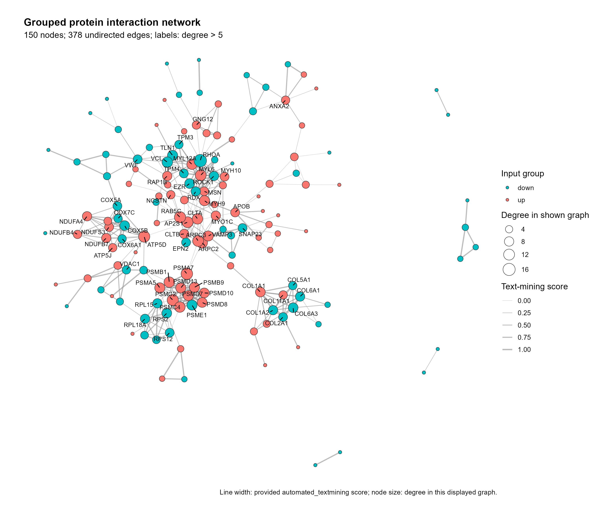

# 分组 PPI 基因互作网络

Grouped protein interaction network

无向互作网络以节点填色表示输入基因分组，节点大小表示展示子图中的连接度，灰色线宽表示 automated_textmining 分数。标签标出给定度数阈值以上的节点。



## 输入与运行

示例范围：**derived_example**。来源 gene_group.csv 150 个基因，string_interactions.csv 378 条无向边；automated_textmining 原值 0–0.952，分组为 up/down。所有节点按完整 gene ID 关联，未查询 STRING 或重新推断网络。

- `data/edges.csv`：from,to,automated_textmining；无向端点和原文本挖掘支持分数
- `data/nodes.csv`：gene,group；唯一节点 ID 及分组

先复制整个模板目录到自己的工作目录，安装下列依赖并将 Rscript 加入 PATH，然后在副本根目录执行：

```sh
Rscript --vanilla code/plot.R
```

R 包：`ggplot2`、`ragg`、`yaml`、`igraph`、`ggrepel`。参数见 [params.yml](params.yml)，字段及约束见 [data_schema.yml](data_schema.yml)。生成 [PNG](preview.png) 和 [PDF](plot.pdf)。完整依赖版本见 [sessionInfo](evidence/sessionInfo.txt)。代码不自动安装软件包。

## 数值含义和排序

- from/to 仅是无向边端点，交换顺序不改变图义；名称保持原字符串，不拆分。
- automated_textmining 为来源文本挖掘支持分数，范围 [0,1]；不是实验结合强度、表达值或整体 combined score。
- 节点 group 按 gene 精确关联全部端点；注释缺失、重复、额外节点均报错，避免行顺序错配。
- 节点大小采用所展示无向子图 degree；默认标签条件 degree > 5，数值只作为标注阈值。
- 禁止重复无向边与自环；不合并未知来源重复记录；零分边保留并使用最小可见线宽。
- KK 布局不使用文本挖掘分数作为距离权重；节点固定按 gene 排序后布局，annotation 行顺序不影响连接和分组。

## 应用场景

- 展示已导出的 STRING 等互作结果与独立基因分组。
- 查看分组节点之间的连接及高连接度节点；互作支持分数不解释为结合强度或因果作用。

## 来源、验证与许可

复现说明：公开副本复跑时，节点坐标和绘制边表与原结果逐字节一致；标签避让位置有小幅变化，因此PNG不保证每次字节一致。随包保留已审阅的原预览。

[来源记录](provenance.md) · [逐文件绘图证据](evidence/render.json) · [验证摘要](evidence/validation-summary.json) · [许可说明](../../LICENSE_NOTICE.md)

本包为获准公开上传的副本，来源许可仍为 unknown；不因托管于本仓库而改为 MIT。绘图和数据接口验证不等于上游分析或科学结论验证。
