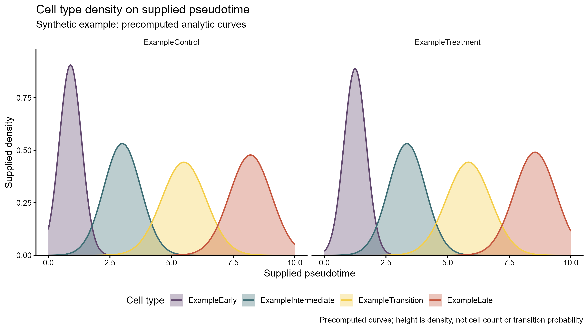

# 拟时轴细胞类型密度图

Cell type density on supplied pseudotime

叠加预计算的细胞类型拟时密度曲线，并按可选分组并列展示，以观察分布峰值位置、范围和形状。



## 输入与运行

示例范围：**synthetic**。celltype×group×pseudotime长表，density为外部预计算有限非负值；group可省略。

- `data/pseudotime_density.csv`：4个示例类型×2组×201点的一维预计算合成密度曲线

先复制整个模板目录到自己的工作目录，安装下列依赖并将 Rscript 加入 PATH，然后在副本根目录执行：

```sh
Rscript --vanilla code/plot.R
```

R 包：`ggplot2`、`ragg`、`yaml`。参数见 [params.yml](params.yml)，字段及约束见 [data_schema.yml](data_schema.yml)。生成 [PNG](preview.png) 和 [PDF](plot.pdf)。完整依赖版本见 [sessionInfo](evidence/sessionInfo.txt)。代码不自动安装软件包。

## 数值含义和排序

- density和pseudotime保持外部输入原值，不重跑Monocle、KDE或拟时根节点选择。
- group可省略，省略时显示一个All data分面；若多个group，拟时单位须由用户保证可比。
- 曲线高度是密度，不是细胞数、细胞比例或状态转移概率；入口不再归一化或按峰值缩放。
- 细胞类型使用具名颜色映射，顺序改变不改变实体颜色；不使用来源p4中标签与图例颜色不一致的映射。
- 合成示例的每条解析高斯曲线在0–10范围用梯形积分归一化为1，仅为图式演示。

## 应用场景

- 在拟时分析完成后展示各细胞类型沿同一拟时坐标的分布，查看它们占据的相对区段。
- 当组间拟时坐标和密度计算方法可比时，按组并列显示相同类型的曲线；曲线不直接支持细胞状态转移概率或因果顺序。

## 来源、验证与许可

[来源记录](provenance.md) · [逐文件绘图证据](evidence/render.json) · [验证摘要](evidence/validation-summary.json) · [许可说明](../../LICENSE_NOTICE.md)

本包为获准公开上传的副本，来源许可仍为 unknown；不因托管于本仓库而改为 MIT。绘图和数据接口验证不等于上游分析或科学结论验证。
