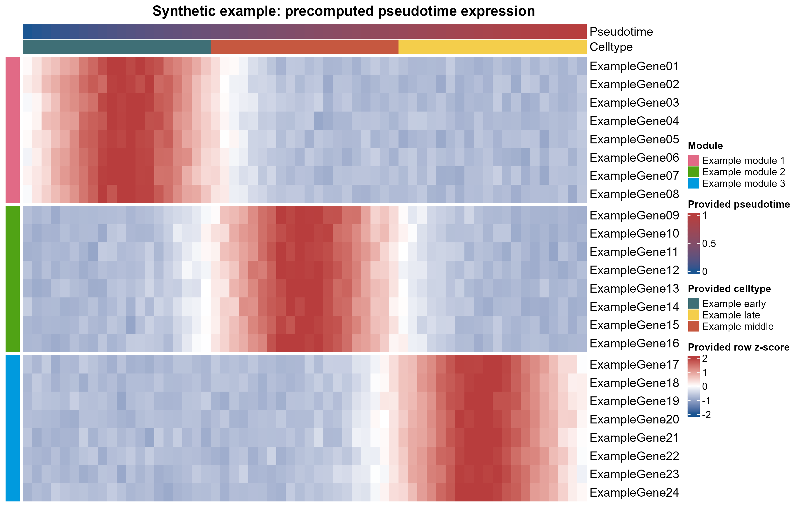

# 拟时序表达热图与模块注释

Precomputed pseudotime expression heatmap

按已有拟时序排列预处理矩阵，显示给定细胞类型和模块；图形不能建立发育方向、分支关系或因果过程。



## 输入与运行

示例范围：**synthetic**。seed=20261002合成24基因×60时间箱已按行z-score矩阵；时间箱和模块均为示例设定。

- `data/expression.csv`：已预处理表达矩阵
- `data/bin_annotations.csv`：bin_id,pseudotime,celltype
- `data/gene_annotations.csv`：gene,module

先复制整个模板目录到自己的工作目录，安装下列依赖并将 Rscript 加入 PATH，然后在副本根目录执行：

```sh
Rscript --vanilla code/plot.R
```

R 包：`ComplexHeatmap`、`circlize`、`ragg`、`yaml`。参数见 [params.yml](params.yml)，字段及约束见 [data_schema.yml](data_schema.yml)。生成 [PNG](preview.png) 和 [PDF](plot.pdf)。完整依赖版本见 [sessionInfo](evidence/sessionInfo.txt)。代码不自动安装软件包。

## 数值含义和排序

- 示例为固定seed合成，不是实验结果
- 不平滑、不再z-score、不聚类模块
- 不运行Monocle全流程；按元数据稳定排序
- 2024-10-14目录p1–p4不是表达热图，不作为本预览的生成证据

## 应用场景

- 上游已提供拟时序及表达矩阵时，可查看关注基因沿该顺序变化。
- 已给模块划分时可显示模块色条；不重新发现模块或推断根细胞。

## 来源、验证与许可

[来源记录](provenance.md) · [逐文件绘图证据](evidence/render.json) · [验证摘要](evidence/validation-summary.json) · [许可说明](../../LICENSE_NOTICE.md)

本包为获准公开上传的副本，来源许可仍为 unknown；不因托管于本仓库而改为 MIT。绘图和数据接口验证不等于上游分析或科学结论验证。
