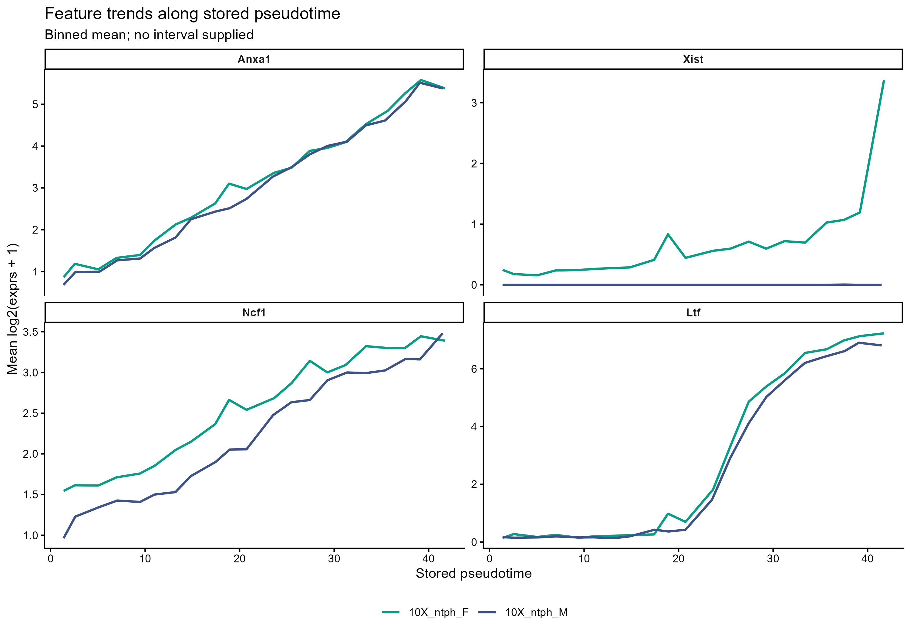

# 基因与通路拟时趋势曲线

Precomputed feature trends along pseudotime

按特征分面、按组着色展示已有拟时趋势；可接收上游提供的区间和细胞点。



## 输入与运行

示例范围：**derived_example**。原教程CellDataSet含6025个细胞的既有拟时。保留Anxa1、Xist、Ncf1、Ltf，按21个固定等宽拟时箱计算各文库mean(log2(exprs+1))；未拟合平滑模型或区间。

- `data/trends.csv`：feature/group/pseudotime/value/lower/upper/n_cells；已计算的趋势点，区间可同时为空
- `data/points.csv`：可选cell_id/feature/group/pseudotime/value；只作点展示，允许只有表头

先复制整个模板目录到自己的工作目录，安装下列依赖并将 Rscript 加入 PATH，然后在副本根目录执行：

```sh
Rscript --vanilla code/plot.R
```

R 包：`ggplot2`、`ragg`、`yaml`。参数见 [params.yml](params.yml)，字段及约束见 [data_schema.yml](data_schema.yml)。生成 [PNG](preview.png) 和 [PDF](plot.pdf)。完整依赖版本见 [sessionInfo](evidence/sessionInfo.txt)。代码不自动安装软件包。

## 数值含义和排序

- 示例曲线是固定21箱的平均值连线，明确标为Binned mean；不能称为拟合曲线或置信区间。
- 示例尺度为log2(原exprs数值+1)，不推断原矩阵是否为原始计数；参数必须明确值尺度。
- 按feature/group分别依拟时排序；同一曲线的拟时坐标唯一。输入lower≤value≤upper，上下界必须同时提供或同时为空。
- 不使用geom_smooth，不重新计算拟时、通路评分、显著性或区间。

## 应用场景

- 展示预计算基因表达趋势或通路评分趋势。
- 比较不同组沿同一拟时尺度的已有汇总，不在绘图时重新拟合轨迹或置信区间。

## 独立数据适配

- [adapters/bin-precomputed-values.R](adapters/bin-precomputed-values.R)

按脚本中的参数说明读取已有对象或结果。适配脚本由宿主单独执行，绘图入口不重跑上游分析。

## 来源、验证与许可

[来源记录](provenance.md) · [逐文件绘图证据](evidence/render.json) · [验证摘要](evidence/validation-summary.json) · [许可说明](../../LICENSE_NOTICE.md)

本包为获准公开上传的副本，来源许可仍为 unknown；不因托管于本仓库而改为 MIT。绘图和数据接口验证不等于上游分析或科学结论验证。
