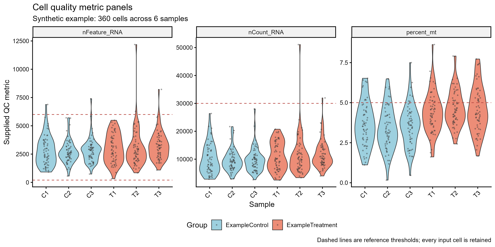

# 细胞质量指标分面图

Cell quality metric panels

并列展示每个样本的基因数、计数总量与线粒体比例，帮助观察指标分布、极端值和参考阈值的位置。



## 输入与运行

示例范围：**synthetic**。每个cell_id一行，sample_id和group标记来源，包含已计算的nFeature_RNA、nCount_RNA和百分制percent_mt。

- `data/qc_metrics.csv`：360个合成细胞，6个示例样本；原指标值

先复制整个模板目录到自己的工作目录，安装下列依赖并将 Rscript 加入 PATH，然后在副本根目录执行：

```sh
Rscript --vanilla code/plot.R
```

R 包：`ggplot2`、`ragg`、`yaml`。参数见 [params.yml](params.yml)，字段及约束见 [data_schema.yml](data_schema.yml)。生成 [PNG](preview.png) 和 [PDF](plot.pdf)。完整依赖版本见 [sessionInfo](evidence/sessionInfo.txt)。代码不自动安装软件包。

## 数值含义和排序

- 入口只读预计算QC指标，所有纳入细胞保留；虚线不触发过滤。
- percent_mt使用0–100百分制，nFeature_RNA与nCount_RNA是非负整数且基因数不超过计数数。
- sample_id用于显示来源，同一样本只映射一个group；细胞点不表示独立生物重复。
- 合成示例固定种子20261011，没有来源的真实细胞QC表。

## 应用场景

- 在过滤前比较不同样本的质量指标分布，识别需要进一步核对的样本或细胞范围。
- 在同一指标的统一坐标下展示外部确定的阈值，保留每个样本的细胞分布；阈值适用性由具体实验确定。

## 来源、验证与许可

[来源记录](provenance.md) · [逐文件绘图证据](evidence/render.json) · [验证摘要](evidence/validation-summary.json) · [许可说明](../../LICENSE_NOTICE.md)

本包为获准公开上传的副本，来源许可仍为 unknown；不因托管于本仓库而改为 MIT。绘图和数据接口验证不等于上游分析或科学结论验证。
