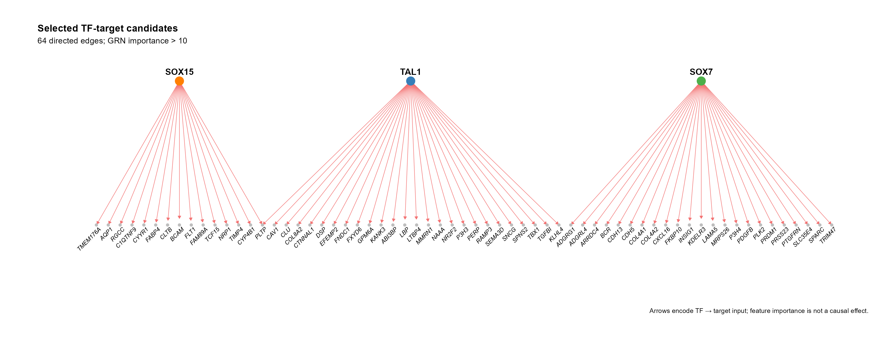

# TF–target 候选定向调控网络

Directed TF–target candidate network

分层布局展示已给 TF→target 候选边，彩色转录因子节点与灰色靶基因节点分开呈现。箭头编码输入方向，importance 可用于筛选和可选线宽，不代表因果效应。



## 输入与运行

示例范围：**derived_example**。原 sce.adj.csv 77,744 行；沿用来源选择 SOX7、SOX15、TAL1 且 importance > 10 后 64 条边、66 个节点。保留原始 importance 与完整名称，不重运行 SCENIC。

- `data/edges.csv`：TF,target,importance；候选方向与原始 feature importance
- `data/nodes.csv`：id,role,colour,order；角色 TF/Target/TF_target，名称一一对应

先复制整个模板目录到自己的工作目录，安装下列依赖并将 Rscript 加入 PATH，然后在副本根目录执行：

```sh
Rscript --vanilla code/plot.R
```

R 包：`ggplot2`、`ragg`、`yaml`、`igraph`、`ggrepel`。参数见 [params.yml](params.yml)，字段及约束见 [data_schema.yml](data_schema.yml)。生成 [PNG](preview.png) 和 [PDF](plot.pdf)。完整依赖版本见 [sessionInfo](evidence/sessionInfo.txt)。代码不自动安装软件包。

## 数值含义和排序

- 方向严格按 TF→target 字段，不拆分下划线、竖线或连字符。
- importance 是上游 GRN feature importance，非概率或调控效应；值不标准化、不重算。筛选采用严格 importance > threshold。
- TF 与 target 同名时节点角色必须为 TF_target，保持同一节点；不得覆盖 TF 身份。
- 节点注释按 id 精确匹配全部输入端点；order 只控制布局顺序；TF,target 边键必须唯一。
- 默认 uniform 保留原例等宽红线；importance 模式仅映射原值到线宽，阈值和模式均在参数声明。
- 筛选后无连接的注释节点不参与本次布局；绘图边和节点坐标写入 evidence，筛选规则不会改变原输入。

## 应用场景

- 查看预计算 pySCENIC GRN 边表中选定 TF 的候选靶基因。
- 比较所选 TF 的共享 target 和连接结构；预测权重只按其原方法含义解释。

## 来源、验证与许可

[来源记录](provenance.md) · [逐文件绘图证据](evidence/render.json) · [验证摘要](evidence/validation-summary.json) · [许可说明](../../LICENSE_NOTICE.md)

本包为获准公开上传的副本，来源许可仍为 unknown；不因托管于本仓库而改为 MIT。绘图和数据接口验证不等于上游分析或科学结论验证。
