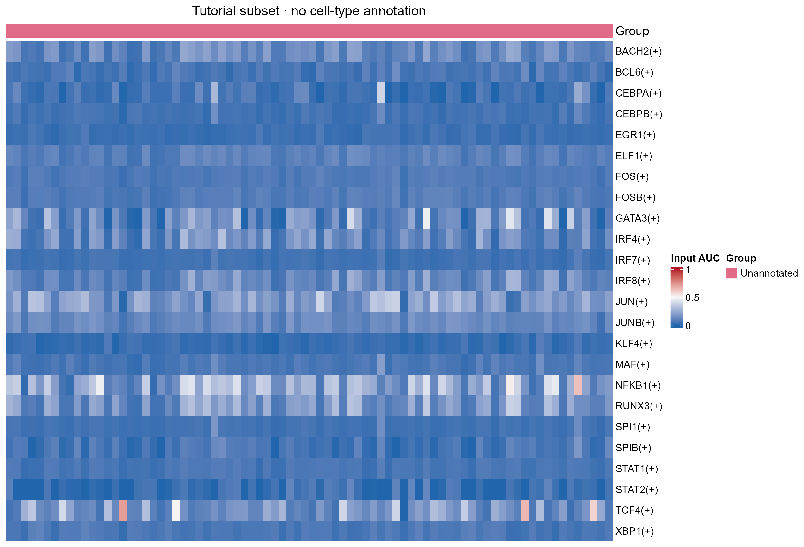

# SCENIC regulon AUC 活性热图

Heatmap of precomputed single-cell regulon AUC

以预计算 AUC 矩阵绘制细胞层面的 regulon 活性热图，可选按 regulon 标准化；提供独立细胞注释与稳定顺序。



## 输入与运行

示例范围：**derived_example**。原 auc.csv 前80个细胞、指定24个regulon的原值子集；原例未提供对应celltype，列注释统一标为Unannotated，不虚构生物分组。

- `data/auc.csv`：第一列regulon，其余列为唯一细胞ID；值为预计算AUC
- `data/cells.csv`：cell_id/group/order；本例group=Unannotated

先复制整个模板目录到自己的工作目录，安装下列依赖并将 Rscript 加入 PATH，然后在副本根目录执行：

```sh
Rscript --vanilla code/plot.R
```

R 包：`ggplot2`、`ragg`、`yaml`、`ComplexHeatmap`、`circlize`。参数见 [params.yml](params.yml)，字段及约束见 [data_schema.yml](data_schema.yml)。生成 [PNG](preview.png) 和 [PDF](plot.pdf)。完整依赖版本见 [sessionInfo](evidence/sessionInfo.txt)。代码不自动安装软件包。

## 数值含义和排序

- 输入是预计算AUC，不是表达量、RSS或CSI；本接口要求有限[0,1]值。
- scale=raw 原值不变；row_zscore逐regulon减均值除样本标准差，常量行置0。
- 行按CSV给定顺序；列按cells.csv order排序，不自动聚类；细胞ID精确匹配。
- Unannotated是缺少类型注释的标记，不能据此解释细胞群。

## 应用场景

- 检查选定细胞与regulon的预计算AUC分布。
- 有真实细胞类型注释时可按给定注释排序，保留原始分数或明确标准化尺度。

## 来源、验证与许可

[来源记录](provenance.md) · [逐文件绘图证据](evidence/render.json) · [验证摘要](evidence/validation-summary.json) · [许可说明](../../LICENSE_NOTICE.md)

本包为获准公开上传的副本，来源许可仍为 unknown；不因托管于本仓库而改为 MIT。绘图和数据接口验证不等于上游分析或科学结论验证。
