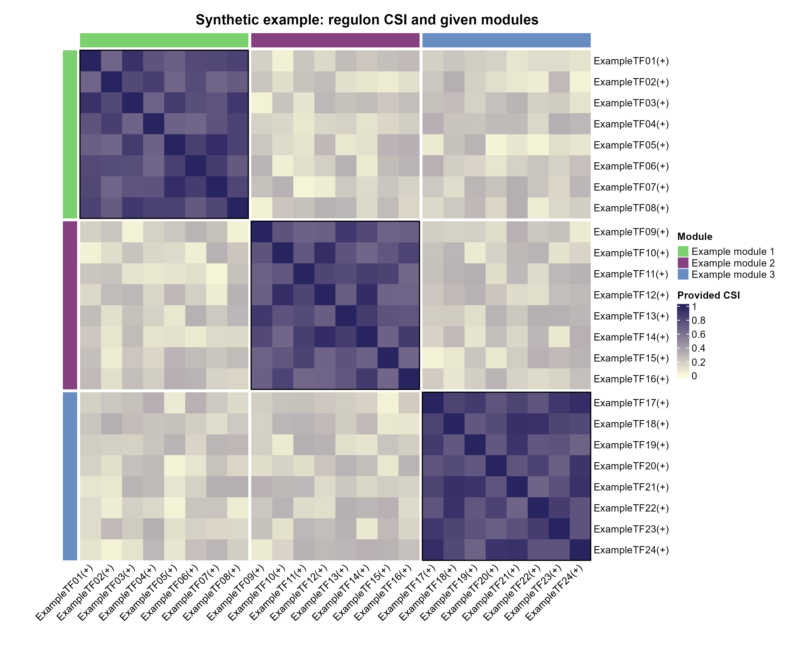

# Regulon CSI模块热图

Regulon CSI heatmap with given modules

方形热图显示已有regulon CSI数值及给定模块。CSI与AUC/RSS不同；模块关联不证明直接调控关系。



## 输入与运行

示例范围：**synthetic**。seed=20261003合成24×24对称CSI示例，值域[0,1]，对角1；模块为预设。

- `data/csi.csv`：预计算对称CSI方阵
- `data/regulon_annotations.csv`：regulon,module

先复制整个模板目录到自己的工作目录，安装下列依赖并将 Rscript 加入 PATH，然后在副本根目录执行：

```sh
Rscript --vanilla code/plot.R
```

R 包：`ComplexHeatmap`、`circlize`、`ragg`、`yaml`。参数见 [params.yml](params.yml)，字段及约束见 [data_schema.yml](data_schema.yml)。生成 [PNG](preview.png) 和 [PDF](plot.pdf)。完整依赖版本见 [sessionInfo](evidence/sessionInfo.txt)。代码不自动安装软件包。

## 数值含义和排序

- 固定seed合成，未将auc.csv当作CSI
- 方阵、同ID、对称、值域[0,1]、对角1；不阈值截零
- 模块为输入标签，不重新发现
- 不运行SCENIC或CSI算法

## 应用场景

- 已有SCENIC下游CSI矩阵及模块标签时，可查看模块内外数值结构。
- 展示regulon活性应使用另一个AUC/RSS模板，不能将其当作CSI。

## 来源、验证与许可

[来源记录](provenance.md) · [逐文件绘图证据](evidence/render.json) · [验证摘要](evidence/validation-summary.json) · [许可说明](../../LICENSE_NOTICE.md)

本包为获准公开上传的副本，来源许可仍为 unknown；不因托管于本仓库而改为 MIT。绘图和数据接口验证不等于上游分析或科学结论验证。
