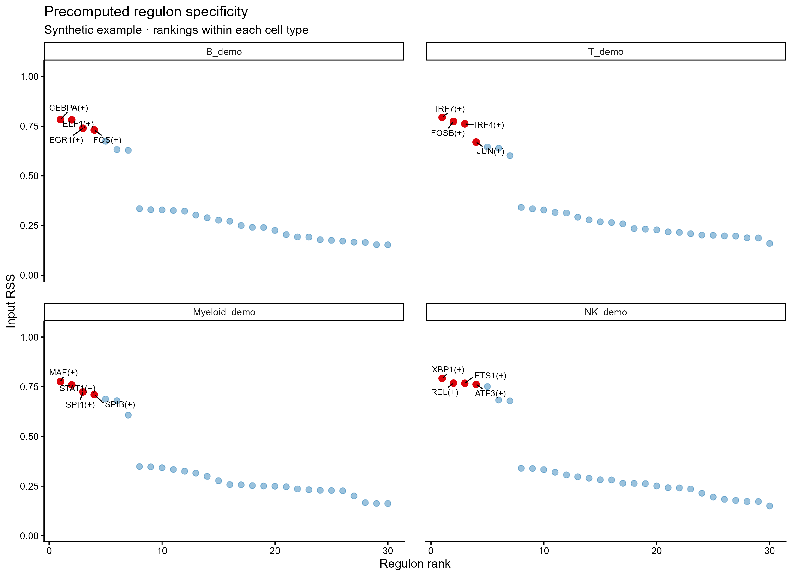

# SCENIC regulon 特异性排序图

Regulon specificity score rank panels

各细胞类型独立按预计算 RSS 降序排列，突出并标注前若干regulon，保留原例蓝色背景点与红色高排名点。



## 输入与运行

示例范围：**synthetic**。合成RSS长表：4个演示细胞类型×30个regulon，固定种子；不从教程AUC重新计算或假称原RSS结果。

- `data/rss.csv`：celltype/regulon/rss；RSS已计算，范围[0,1]

先复制整个模板目录到自己的工作目录，安装下列依赖并将 Rscript 加入 PATH，然后在副本根目录执行：

```sh
Rscript --vanilla code/plot.R
```

R 包：`ggplot2`、`ragg`、`yaml`、`ggrepel`。参数见 [params.yml](params.yml)，字段及约束见 [data_schema.yml](data_schema.yml)。生成 [PNG](preview.png) 和 [PDF](plot.pdf)。完整依赖版本见 [sessionInfo](evidence/sessionInfo.txt)。代码不自动安装软件包。

## 数值含义和排序

- RSS是预计算specificity score，输入值不做zscore，不重算RSS。
- 每celltype内rss降序，平分时按regulon完整字符串升序，排名从1开始。
- top_n只控制标注数量，不筛选显著性；不生成pvalue。
- 每celltype/regulon唯一；各细胞类型须具有相同regulon集合，避免比较不同候选全集。

## 应用场景

- 展示上游已计算并保存的regulon specificity score。
- 按给定细胞类型比较排名；RSS不等价于调控因果或表达量。

## 来源、验证与许可

[来源记录](provenance.md) · [逐文件绘图证据](evidence/render.json) · [验证摘要](evidence/validation-summary.json) · [许可说明](../../LICENSE_NOTICE.md)

本包为获准公开上传的副本，来源许可仍为 unknown；不因托管于本仓库而改为 MIT。绘图和数据接口验证不等于上游分析或科学结论验证。
