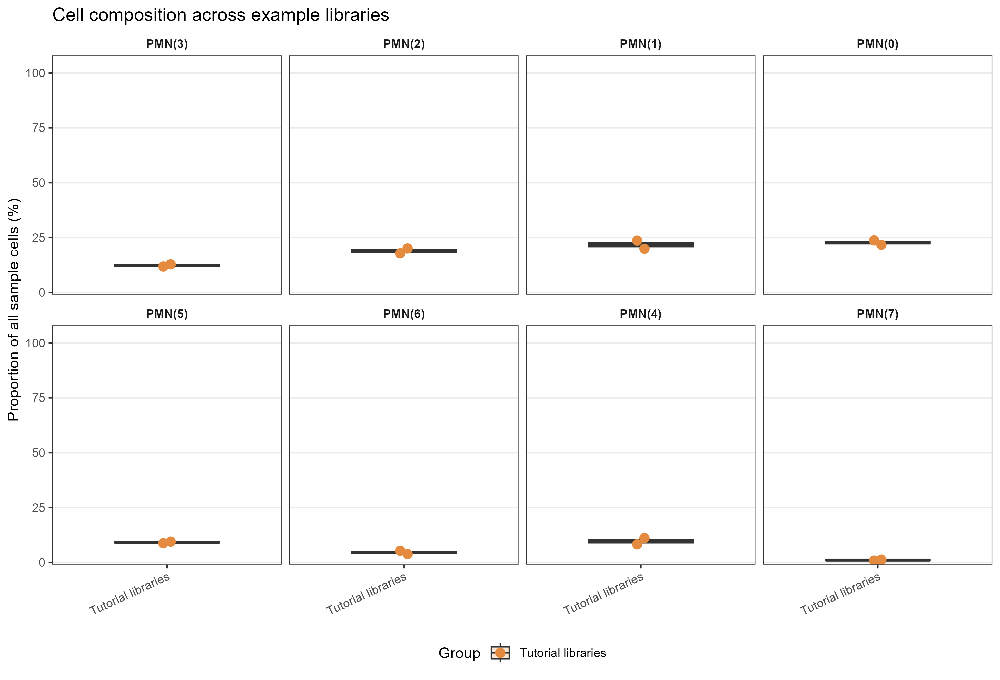

# 样本细胞类型比例箱线与点图

Sample cell-type proportions

以每个样本为绘图单位，分面展示细胞类型比例的箱线和样本点；分母独立保存，筛选细胞类型后仍保持原比例。



## 输入与运行

示例范围：**derived_example**。从原教程已处理的6025个细胞注释汇总两个文库的8种细胞类型；文库是绘图单位，未确认其独立生物学重复身份。

- `data/counts.csv`：sample_id/group/cell_type/count/total_cells；分母为该样本全部输入细胞
- `data/comparisons.csv`：可选cell_type/group1/group2/y/label，只有表头表示无比较标注

先复制整个模板目录到自己的工作目录，安装下列依赖并将 Rscript 加入 PATH，然后在副本根目录执行：

```sh
Rscript --vanilla code/plot.R
```

R 包：`ggplot2`、`ragg`、`yaml`。参数见 [params.yml](params.yml)，字段及约束见 [data_schema.yml](data_schema.yml)。生成 [PNG](preview.png) 和 [PDF](plot.pdf)。完整依赖版本见 [sessionInfo](evidence/sessionInfo.txt)。代码不自动安装软件包。

## 数值含义和排序

- 先计算count/total_cells×100，再筛选显示的细胞类型；不得对筛选后的计数重新归一化。
- 每个样本只能归属一个组；total_cells在同一样本各行必须一致；默认要求完整组成、计数和等于分母，零计数必须显式提供。
- 箱线按样本比例汇总，各样本权重相同；不把每个细胞当成独立重复，不运行显著性检验。
- comparisons中的标签由上游提供；示例没有比较标注。

## 应用场景

- 查看各样本的细胞组成及样本之间的离散程度。
- 按实验分组展示样本层面的比例，可叠加已有比较标注。

## 独立数据适配

- [adapters/counts-from-metadata.R](adapters/counts-from-metadata.R)

按脚本中的参数说明读取已有对象或结果。适配脚本由宿主单独执行，绘图入口不重跑上游分析。

## 来源、验证与许可

[来源记录](provenance.md) · [逐文件绘图证据](evidence/render.json) · [验证摘要](evidence/validation-summary.json) · [许可说明](../../LICENSE_NOTICE.md)

本包为获准公开上传的副本，来源许可仍为 unknown；不因托管于本仓库而改为 MIT。绘图和数据接口验证不等于上游分析或科学结论验证。
