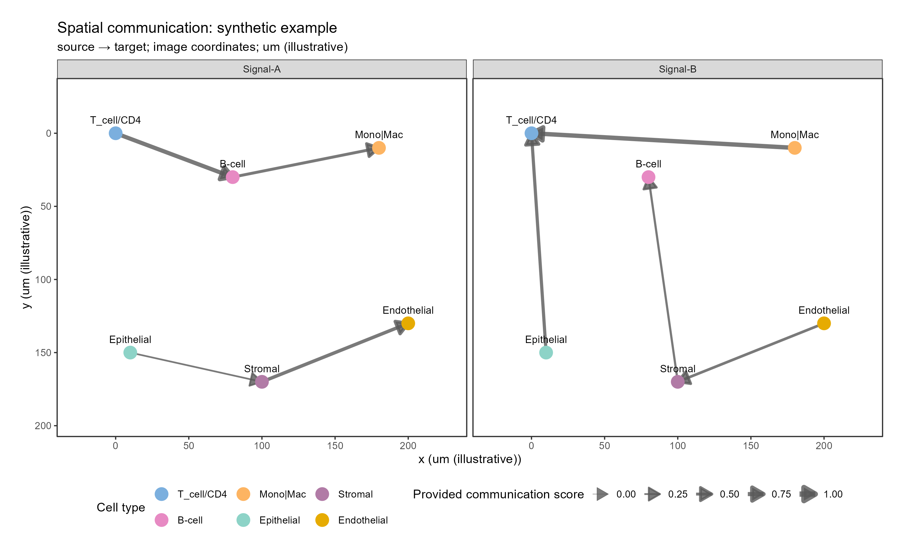

# 空间细胞通讯叠加图

Spatial communication overlay

在固定空间坐标上显示细胞类型节点和定向通讯边，按信号分面、用线宽展示提供的通讯分数。



## 输入与运行

示例范围：**synthetic**。合成输入含6个群体中心、2个信号和8条定向边；坐标单位为示意微米。用于接口和方向验证，不对应真实组织或CellChat推断。

- `data/nodes.csv`：node_id/sample_id/cell_type/x/y；节点可为已有群体中心或spot
- `data/edges.csv`：edge_id/source/target/signal/ligand/receptor/weight；名称分列
- `data/celltype_colors.csv`：cell_type/color；覆盖全部节点类别

先复制整个模板目录到自己的工作目录，安装下列依赖并将 Rscript 加入 PATH，然后在副本根目录执行：

```sh
Rscript --vanilla code/plot.R
```

R 包：`ggplot2`、`ragg`、`yaml`。参数见 [params.yml](params.yml)，字段及约束见 [data_schema.yml](data_schema.yml)。生成 [PNG](preview.png) 和 [PDF](plot.pdf)。完整依赖版本见 [sessionInfo](evidence/sessionInfo.txt)。代码不自动安装软件包。

## 数值含义和排序

- 输入坐标不交换x/y；image模式只反转显示y轴，cartesian模式纵轴向上，使用相同固定比例。
- 箭头从source指向target；两个端点必须位于同一样本，本模板展示单一样本。
- ligand和receptor独立列保存，禁止拆分含下划线、竖线、连字符的名称。
- 每个signal/source/target组合只允许一个已汇总的边；不同LR行不得在绘图时隐式相加。
- weight是输入的预计算分数，不等同于空间距离、蛋白结合或因果证据。没有组织图像时不生成假组织背景。

## 应用场景

- 展示已有空间通讯结果与节点坐标的对应关系。
- 比较不同信号在同一样本坐标中的边分布。

## 独立数据适配

- [adapters/edges-from-cellchat-table.R](adapters/edges-from-cellchat-table.R)

按脚本中的参数说明读取已有对象或结果。适配脚本由宿主单独执行，绘图入口不重跑上游分析。

## 来源、验证与许可

[来源记录](provenance.md) · [逐文件绘图证据](evidence/render.json) · [验证摘要](evidence/validation-summary.json) · [许可说明](../../LICENSE_NOTICE.md)

本包为获准公开上传的副本，来源许可仍为 unknown；不因托管于本仓库而改为 MIT。绘图和数据接口验证不等于上游分析或科学结论验证。
