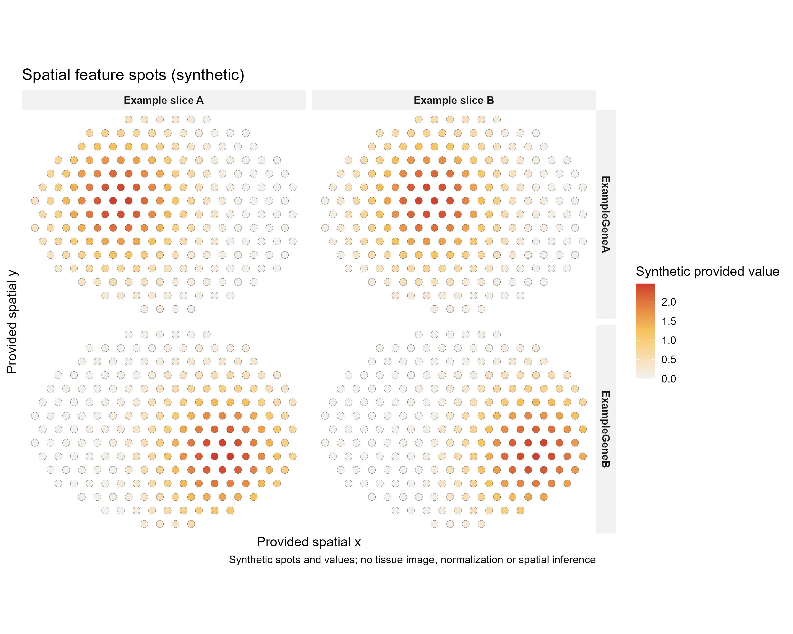

# 空间spot特征数值图

Spatial feature spots (synthetic)

输入spot坐标与提供数值，按切片和特征分面。默认反转y轴以适合左上角图像原点，不添加未提供的组织图。



## 输入与运行

示例范围：**synthetic**。sample/spot_id/feature/x/y/value；同样本spot位置跨特征一致。

- `data/spots.csv`：sample/spot_id/feature/x/y/value；同样本spot位置跨特征一致。

先复制整个模板目录到自己的工作目录，安装下列依赖并将 Rscript 加入 PATH，然后在副本根目录执行：

```sh
Rscript --vanilla code/plot.R
```

R 包：`ggplot2`、`yaml`、`ragg`。参数见 [params.yml](params.yml)，字段及约束见 [data_schema.yml](data_schema.yml)。生成 [PNG](preview.png) 和 [PDF](plot.pdf)。完整依赖版本见 [sessionInfo](evidence/sessionInfo.txt)。代码不自动安装软件包。

## 数值含义和排序

- seed=20261004；两切片、两特征均为合成；同一spot跨特征坐标必须一致。
- x/y为同一空间坐标基准；reverse_y仅改变显示方向，不归一化或缩放坐标。
- value非负且保持原数值；不运行SCTransform或空间统计。
- 未提供histology image，因此不叠加组织背景。

## 应用场景

用于已有spot坐标下展示基因或非负特征数值的空间分布，按切片和特征比较局部高值区域。

## 来源、验证与许可

[来源记录](provenance.md) · [逐文件绘图证据](evidence/render.json) · [验证摘要](evidence/validation-summary.json) · [许可说明](../../LICENSE_NOTICE.md)

本包为获准公开上传的副本，来源许可仍为 unknown；不因托管于本仓库而改为 MIT。绘图和数据接口验证不等于上游分析或科学结论验证。
