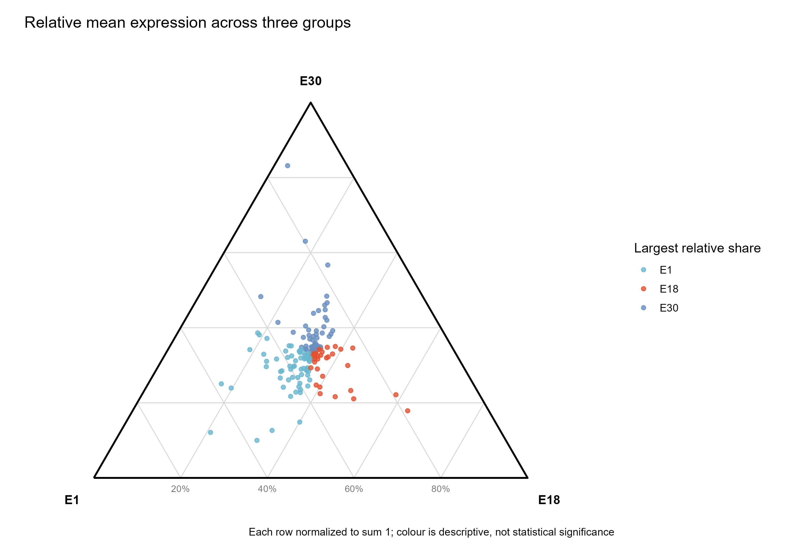

# 三组表达三元图

Ternary expression plot

三个非负量转换成总和为一的组成；靠近某顶点表示该组比例较高。三元位置不能代替差异表达检验。



## 输入与运行

示例范围：**derived_example**。E1/E18/E30各3个重复求算术均值，按文件顺序取均值总和>0.1的前150基因。

- `data/expression.csv`：gene及非负a,b,c

先复制整个模板目录到自己的工作目录，安装下列依赖并将 Rscript 加入 PATH，然后在副本根目录执行：

```sh
Rscript --vanilla code/plot.R
```

R 包：`ggplot2`、`ragg`、`yaml`。参数见 [params.yml](params.yml)，字段及约束见 [data_schema.yml](data_schema.yml)。生成 [PNG](preview.png) 和 [PDF](plot.pdf)。完整依赖版本见 [sessionInfo](evidence/sessionInfo.txt)。代码不自动安装软件包。

## 数值含义和排序

- 只作行归一化，不额外log变换
- 最大占比颜色不代表统计显著性；平局为Tie
- a左下、b右下、c顶部
- 底边20%刻度表示b/E18份额；其余网格为三个组的固定份额线

## 应用场景

- 若三组有可比较表达量，可查看所选基因的相对分配。
- 点大小可补充总表达量，均值方法应在图注说明。

## 来源、验证与许可

[来源记录](provenance.md) · [逐文件绘图证据](evidence/render.json) · [验证摘要](evidence/validation-summary.json) · [许可说明](../../LICENSE_NOTICE.md)

本包为获准公开上传的副本，来源许可仍为 unknown；不因托管于本仓库而改为 MIT。绘图和数据接口验证不等于上游分析或科学结论验证。
