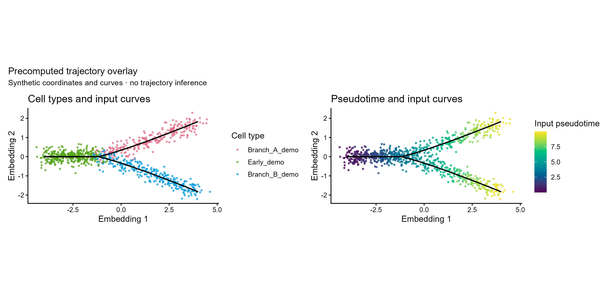

# 拟时轨迹曲线与降维叠加图

Precomputed trajectory curves over an embedding

将已给曲线采样点叠加于降维坐标，分别按细胞类型和预计算拟时序着色；不重新拟合轨迹。



## 输入与运行

示例范围：**synthetic**。合成900个细胞坐标、3个演示celltype、两条各100采样点曲线；缺少原mouse_data.rds与拟合对象，不能复现原推断。

- `data/cells.csv`：cell_id/x/y/celltype/pseudotime；唯一细胞坐标
- `data/curves.csv`：lineage/order/x/y；预拟合曲线采样点

先复制整个模板目录到自己的工作目录，安装下列依赖并将 Rscript 加入 PATH，然后在副本根目录执行：

```sh
Rscript --vanilla code/plot.R
```

R 包：`ggplot2`、`ragg`、`yaml`、`patchwork`。参数见 [params.yml](params.yml)，字段及约束见 [data_schema.yml](data_schema.yml)。生成 [PNG](preview.png) 和 [PDF](plot.pdf)。完整依赖版本见 [sessionInfo](evidence/sessionInfo.txt)。代码不自动安装软件包。

## 数值含义和排序

- 曲线完全由输入采样点给定；按lineage/order连接，不用细胞坐标重新拟合。
- pseudotime保持输入数值，不归一化；缺失或非有限值报错，本批次不隐式删细胞。
- 曲线每lineage至少2点、order唯一正整数；cell_id全表唯一，类型完整字符串保留。
- 左右面板使用同一坐标比例，细胞类型按出现顺序；不加未经输入支持的方向箭头。

## 应用场景

- 将Slingshot/Monocle等已有轨迹结果转换为标准坐标与曲线表后复用。
- 对照输入细胞类型、曲线位置和拟时序；图形展示不验证起点或分支推断。

## 来源、验证与许可

[来源记录](provenance.md) · [逐文件绘图证据](evidence/render.json) · [验证摘要](evidence/validation-summary.json) · [许可说明](../../LICENSE_NOTICE.md)

本包为获准公开上传的副本，来源许可仍为 unknown；不因托管于本仓库而改为 MIT。绘图和数据接口验证不等于上游分析或科学结论验证。
