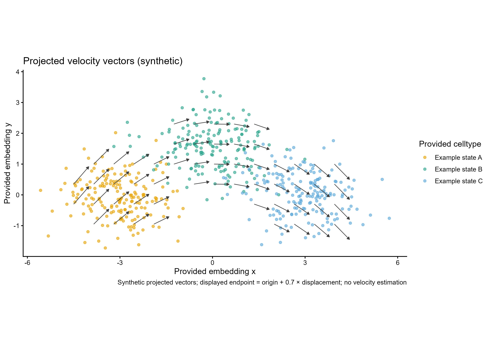

# 预计算嵌入速度矢量图

Projected velocity vectors (synthetic)

绘制已有cell坐标与同坐标基准的网格位移向量。模板不估计RNA velocity、不计算流线或重新投影。



## 输入与运行

示例范围：**synthetic**。cell_id/x/y/celltype；540个合成细胞。; vector_id/x/y/dx/dy；预计算合成网格位移，非RNA velocity估计。

- `data/cells.csv`：cell_id/x/y/celltype；540个合成细胞。
- `data/vectors.csv`：vector_id/x/y/dx/dy；预计算合成网格位移，非RNA velocity估计。

先复制整个模板目录到自己的工作目录，安装下列依赖并将 Rscript 加入 PATH，然后在副本根目录执行：

```sh
Rscript --vanilla code/plot.R
```

R 包：`ggplot2`、`yaml`、`ragg`。参数见 [params.yml](params.yml)，字段及约束见 [data_schema.yml](data_schema.yml)。生成 [PNG](preview.png) 和 [PDF](plot.pdf)。完整依赖版本见 [sessionInfo](evidence/sessionInfo.txt)。代码不自动安装软件包。

## 数值含义和排序

- seed=20261005；细胞、类型、网格位移完全合成；不是由spliced/unspliced估计。
- vectors的x/y/dx/dy必须已经处于cells的同一嵌入坐标基准；vector_id为网格点ID，不需冒充cell_id。
- 显示端点严格为(x+vector_scale*dx,y+vector_scale*dy)，不按长度归一化；零向量保留但至少应有一个非零向量。
- 嵌入矢量只是提供的模型/示例量；不能据此证明分化方向或因果关系。

## 应用场景

用于展示已有RNA velocity或其他模型已投影到嵌入的位移向量，检查给定细胞状态与局部预测向量的空间关系。

## 来源、验证与许可

[来源记录](provenance.md) · [逐文件绘图证据](evidence/render.json) · [验证摘要](evidence/validation-summary.json) · [许可说明](../../LICENSE_NOTICE.md)

本包为获准公开上传的副本，来源许可仍为 unknown；不因托管于本仓库而改为 MIT。绘图和数据接口验证不等于上游分析或科学结论验证。
